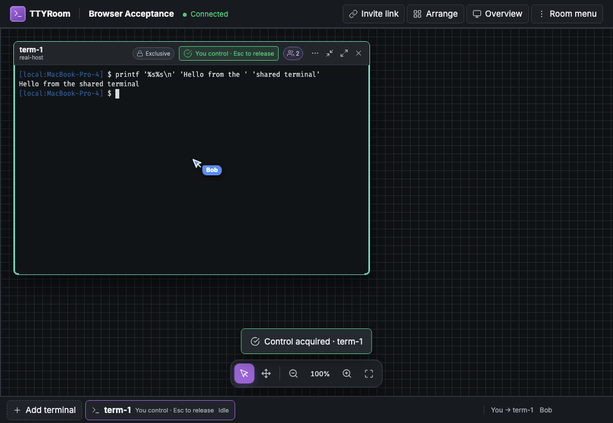
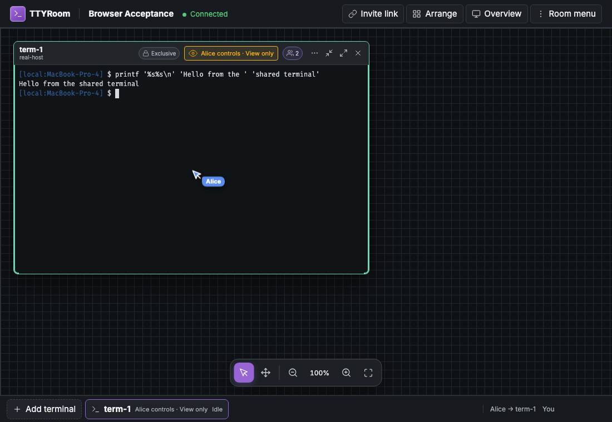
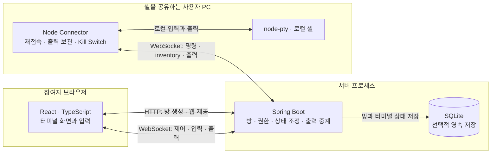

# TTYRoom

브라우저에서 여러 사람이 로컬 터미널을 함께 보고 조작하는 협업 도구입니다.
셸을 공유하는 사람은 자신의 PC에서 Connector를 실행하고, 다른 참여자는 초대 주소로 입장합니다.
프론트엔드·백엔드·Connector와 통신 규약·테스트를 직접 설계하고 개발한 개인 프로젝트입니다.

## 실제 협업 화면

[시연 영상 — 1분 29초, MP4](docs/demo/ttyroom-demo.mp4) · [시연 범위와 재현 방법](docs/demo/README.md)

| Alice — 입력 제어권 보유                                              | Bob — 같은 출력 관찰                                                        |
| --------------------------------------------------------------------- | --------------------------------------------------------------------------- |
|  |  |

로컬 Spring 서버와 실제 Connector·PTY를 연결해 캡처했습니다.
[원본 화면과 캡처 조건](docs/images/README.md)을 참고하세요.

## 주요 기능

- **터미널 협업:** 같은 셸 출력과 제목·창 배치를 여러 참여자가 공유합니다.
- **입력 제어:** exclusive 제어권 또는 shared 입력 모드를 사용합니다.
- **로컬 차단권:** 공유자는 Connector에서 `k`를 눌러 원격 입력을 차단합니다.
- **재접속 복구:** 살아 있는 Connector의 PTY inventory와 보관된 출력을 서버와 다시 맞춥니다.
- **선택적 영속 저장:** SQLite를 사용하면 서버 재시작 후 방·터미널 상태를 복원합니다.

## 시스템 구성



**셸은 서버가 아니라 공유자의 PC에서 실행됩니다.** Connector는 서버로 연결하고,
다른 참여자는 브라우저만으로 같은 출력을 보거나 입력 권한을 받아 조작합니다.
위 구분은 실행 책임을 나타내며, 기본 로컬 실행에서는 같은 컴퓨터에서 모두 실행할 수 있습니다.
현재 Spring은 `127.0.0.1`에 바인딩합니다.

초대 토큰을 가진 참여자와 서버를 신뢰하는 로컬 실험 구성입니다. 입력 허용은 공유자 PC의
실제 셸 실행 권한이며, View only 표시는 영구 읽기 전용 권한이 아닙니다.
[보안 모델과 공개 배포 전 과제](docs/SECURITY_MODEL.md)를 확인하세요.

SQLite에는 방·터미널의 영속 상태를 저장합니다. 연결·lease·focus·출력 history는
서버 재시작 시 초기화하며, 살아 있는 Connector가 PTY inventory와 보관된 출력을 다시 전달합니다.
셸 프로세스 자체를 DB에 저장하지 않습니다.

[상태 변경과 실패 시퀀스](docs/ARCHITECTURE.md)에서 저장·commit·알림의 경계를 설명합니다.

## 빠른 시작 — Spring + React + Connector

Java 21 JDK(`JAVA_HOME`), Node.js 22 이상, pnpm 10.10.0이 필요합니다.
저장소 루트에서 실행합니다.

```sh
pnpm install --frozen-lockfile
./scripts/build-spring.sh
TTYROOM_STATE_PATH=.ttyroom/v8-rooms.sqlite ./scripts/run-spring.sh
```

빌드 스크립트는 protocol·Connector·React를 빌드하고 Gradle의 Java 테스트와
웹 포함 JAR 생성을 실행합니다. 실행 스크립트는 빌드된 JAR를 시작합니다.
소스를 수정했다면 다시 빌드합니다. API-only `bootJar`로 덮어쓴 경우에도 웹 포함 빌드를 다시 합니다.

브라우저에서 `http://127.0.0.1:3000`을 열어 방을 만듭니다.
방을 만든 탭에서 **Add Host → Generate host credential**을 선택합니다.
다른 터미널에서 비밀값 없는 방 주소로 Connector를 실행하고, `Host credential:` 프롬프트에
복사한 Host credential을 붙여 넣습니다. 입력은 화면에 표시되지 않습니다.

```sh
node connector/dist/index.js join "http://localhost:3000/r/ROOM_ID" --name "내 컴퓨터"
```

실행 스크립트의 작업 디렉터리는 저장소 루트이므로 상대 설정·SQLite 경로도 루트 기준입니다.
`TTYROOM_STATE_PATH`를 생략하면 Spring은 메모리 모드로 실행합니다.
Spring은 기본적으로 저장된 방 4개·WebSocket 16개·terminal 16개·retained payload 16 MiB를 제한합니다.
Credential은 manager를 포함해 방별 64개·서버 전체 128개까지 보관합니다.
[설정과 자원 수명](docs/DEVELOPMENT.md#전역-admission-예산-spring)을 확인하세요. 이 값은 배포 수용량 보장이 아닙니다.
현재 Spring은 `127.0.0.1`에 바인딩하므로 이 안내는 로컬 실행 기준입니다.

Connector 터미널에서 `k`는 원격 입력 차단을 전환하고 `Ctrl+C`는 Connector와 로컬 셸을 종료합니다.
CLI는 저장소 설치 기준이며 npm 공개 배포를 의미하지 않습니다.
참가자에게는 **Invite**로 복사한 초대 링크만 전달합니다. 관리 credential은 방 생성 탭의
sessionStorage에, 참가자 credential은 각 탭에, Host credential은 Connector 프로세스 메모리에 보관합니다.
기존 v7 저장 파일이 있다면 서버를 종료하고 원본 파일을 유지한 채 위의 새 경로·새 방으로 시작합니다.
[전환 및 복구 한계](docs/DEVELOPMENT.md#v8-기본-실행과-기존-저장-파일)도 확인하세요.

## 설계와 테스트를 읽는 순서

- [핵심 계약–코드–테스트 대응표](docs/CONTRACTS.md): 대표 설계를 실제 구현과 검증에서 따라가는 경로.
- [산출물 없는 복사본의 실행 재현](docs/WORK_LOG.md#공개-재현과-시연): 첫 설치에서 발견한 CLI 경로 문제와 수정·검증 범위.
- [포트폴리오·면접용 설계 설명](docs/PORTFOLIO.md): 협업 기능의 설계 판단, 선택과 비용, 코드·테스트 근거.
- [코드·테스트 작성 가이드](docs/CODE_STYLE.md): fixture·행동·관찰·assertion의 책임과 예시.
- [백엔드 설계](backend/ARCHITECTURE.md): 상태·세션·전송·저장의 책임과 실패 처리 경계.
- [저장 성공 후 알림 실패](docs/WORK_LOG.md#자원-수명과-실패-처리): commit과 전달 성공을 구분하는 계약 테스트.
- [Connector 실패 분류 수정](docs/WORK_LOG.md#자원-수명과-실패-처리): 실패 테스트부터 수정한 RED → GREEN 사례.
- [프론트엔드 종료 경계 수정](docs/WORK_LOG.md#자원-수명과-실패-처리): 종료 후 재시작 방지의 RED → GREEN 사례.
- [검증 기록](docs/VERIFICATION.md): 현재 점검과 이전 Node/Spring 브라우저 검증의 범위.
- [성능 측정](docs/PERFORMANCE.md): 고정 부하·원시 결과와 수신 버퍼 수정 전후의 메모리 비교.

리팩터링의 GREEN → REFACTOR → GREEN과 오류 수정의 RED → GREEN을 구분합니다.
실행 환경과 소스별 로컬·CI 결과를 구분해 기록합니다. 입력 exactly-once와 공개 서비스 운영은 보장 범위에 포함하지 않습니다.

## 개발과 검증

[개발·검증 안내](docs/DEVELOPMENT.md)에 디렉터리 구조, Java 단독 개발,
테스트별 명령과 CI 역할을 정리했습니다.

- [백엔드 상세 안내](backend/README.md)
- [E2E 실행·작성 기준](e2e/README.md)
- [현재 통신 규약](protocol/PROTOCOL.md)
- [HTTP API 계약](protocol/HTTP.md)

[문서 안내](docs/README.md)에서 현재 안내와 과거 작업 기록을 구분해 볼 수 있습니다.
