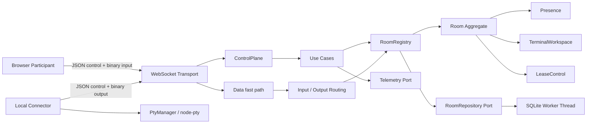
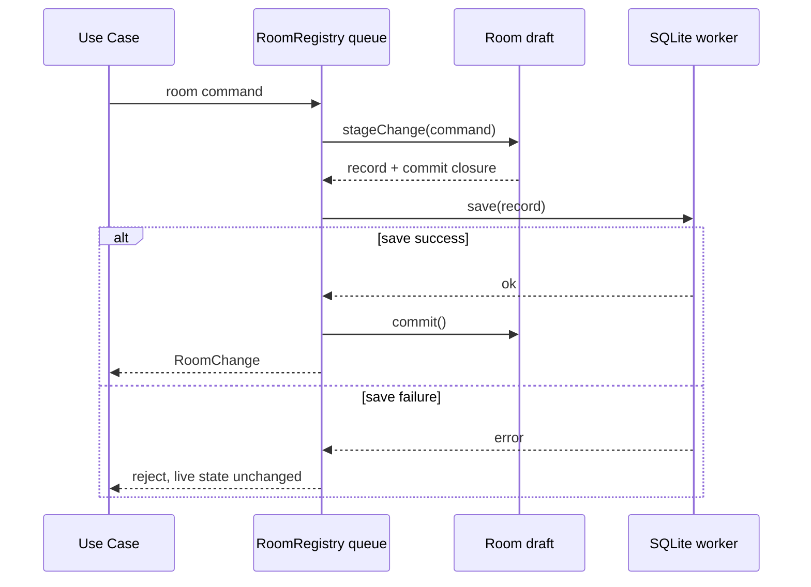

# TTYRoom Engineering Deep Dive

> 면접·포트폴리오를 위한 전공지식 기반 설계 회고  
> 검토일: 2026-09-18  
> 기준: `main` 브랜치의 현재 working tree  
> 범위: Protocol, Server, Connector, E2E와 백엔드 리팩터링 결과

## Preface. 이 문서가 답하려는 질문

TTYRoom은 브라우저에서 원격 셸을 함께 보고 조작하는 협업 터미널이다. 겉으로는 WebSocket과 PTY를 연결한 작은 애플리케이션처럼 보이지만, 실제로는 다음 질문들이 한 흐름 안에서 충돌한다.

- 누가 지금 입력할 권한을 가지는가?
- 네트워크가 끊겼다가 돌아오면 어떤 출력을 다시 보내야 하는가?
- 느린 클라이언트 하나가 전체 세션을 망치지 않게 하려면 어떻게 해야 하는가?
- 동기 SQLite I/O가 Node.js 이벤트 루프를 막지 않게 하려면 어떻게 해야 하는가?
- DB 저장과 메모리 상태 변경 사이의 비동기 경합을 어떻게 통제하는가?
- 셸 입력과 토큰 같은 민감 데이터를 남기지 않고도 운영 가능한 관측성을 어떻게 확보하는가?

이 문서는 패턴 이름을 나열하는 자료가 아니다. 현재 코드에서 확인되는 사실, 그 사실을 컴퓨터공학 개념으로 설명하는 방식, 아직 구현하지 않은 경계를 구분한다.

### 증거 수준

| 표시          | 의미                                                       |
| ------------- | ---------------------------------------------------------- |
| **구현 확인** | 현재 소스와 테스트에서 직접 확인했다.                      |
| **설계 해석** | 구현을 전공지식·방법론 관점에서 해석한 것이다.             |
| **한계/후속** | 아직 구현되지 않았거나 부하·운영 환경에서 검증되지 않았다. |

### 한눈에 보는 면접 소재

| 분야         | 현재 코드에서 설명할 수 있는 핵심                                           | 소재 강도 | 과장하면 안 되는 지점                            |
| ------------ | --------------------------------------------------------------------------- | --------- | ------------------------------------------------ |
| 운영체제     | PTY 수명주기, signal, resize, UTF-8 streaming, worker thread                | 강함      | 컨테이너 격리·sandbox 구현은 아님                |
| 자료구조     | Map 기반 registry, bounded replay/scrollback, token bucket                  | 강함      | 일부 배열 큐의 `shift()`는 O(n)                  |
| 동시성       | per-room/per-connection 직렬화, staged commit, late callback identity guard | 강함      | 단일 프로세스 내부 동시성 제어임                 |
| 네트워크     | WebSocket multiplexing, binary framing, ordering, backpressure, reconnect   | 강함      | 단일 TCP 연결이므로 물리적 HOL 분리는 아님       |
| 데이터베이스 | SQLite worker, strict schema, snapshot upsert, save-before-commit           | 중상      | JSON blob, migration/WAL 전략은 초기 단계        |
| 메시징/EIP   | command/event 분리, router, resequencing, idempotent output receiver        | 중상      | broker·outbox·exactly-once·event sourcing은 없음 |
| 보안         | fragment token, digest 저장, timing-safe 비교, local kill switch            | 중상      | 실사용자 인증·세밀한 RBAC·E2E 암호화는 없음      |
| 운영성       | 구조화 telemetry, backpressure gap, graceful drain, recovery E2E            | 중상      | readiness·부하/soak·분산 장애 검증은 없음        |
| 설계 방법론  | Aggregate, Ports/Adapters, SOLID, deep module, contract test                | 강함      | “순수 DDD”보다 실용적 혼합 구조에 가까움         |

---

## Chapter 1. 문제를 시스템으로 바꾸기

### 1.1 핵심 도메인

TTYRoom의 핵심 모델은 다음과 같다.

- **Room**: 협업 세션과 불변식을 소유하는 Aggregate Root
- **Participant**: 브라우저에서 입장한 참여자
- **Host**: 로컬 Connector가 연결된 실행 주체
- **Terminal**: Host가 생성한 PTY의 협업 단위
- **Lease**: 특정 터미널에 입력할 수 있는 권한
- **Connection**: Participant 또는 Host와 서버 사이의 전송 연결

도메인의 본질은 “문자열을 전달하는 것”보다 “연결이 흔들려도 권한과 상태의 의미를 유지하는 것”이다. 따라서 서버는 단순 WebSocket relay가 아니라 Room 상태와 권한을 판정하는 Control Plane이면서, 터미널 바이트를 전달하는 Data Plane 역할도 함께 한다.

### 1.2 현재 아키텍처



이 구조의 중요한 선택은 두 가지다.

1. **프로토콜·저장소·시간·관측성처럼 실제로 바뀌는 경계에만 port를 둔다.** 모든 클래스를 interface로 감싸지 않는다.
2. **Room이 복잡한 규칙을 숨기는 깊은 모듈이 된다.** 호출자는 Presence, Workspace, Lease의 내부 갱신 순서를 알 필요가 없다.

### 1.3 코드에서 확인되는 책임 경계

| 경계              | 소유 책임                                   | 대표 코드                                            |
| ----------------- | ------------------------------------------- | ---------------------------------------------------- |
| Protocol          | wire schema, binary frame, version          | `packages/protocol/src/messages.ts`, `data-frame.ts` |
| Transport         | 연결, 순서, queue, drain                    | `packages/server/src/adapters/ws/ws-transport.ts`    |
| Application       | command routing, workflow, protocol mapping | `packages/server/src/usecases/`                      |
| Domain            | Room invariant, presence, terminal, lease   | `packages/server/src/domain/`                        |
| Persistence       | stored schema, SQLite worker                | `packages/server/src/adapters/sqlite/`               |
| Connector runtime | PTY, reconnect, replay, rate limiting       | `packages/connector/src/`                            |

---

## Chapter 2. 운영체제: PTY는 단순 프로세스 실행이 아니다

### 2.1 PTY의 의미

일반 pipe와 달리 PTY(pseudo-terminal)는 프로그램에 터미널처럼 보이는 장치를 제공한다. 셸과 TUI 프로그램은 다음과 같은 터미널 특성에 의존한다.

- 행/열 크기
- 터미널 모드와 제어 문자
- `TERM=xterm-256color`
- foreground process group과 signal
- 터미널이 닫혔을 때의 hangup 동작

`PtyManager`는 `node-pty`를 통해 셸을 생성하고, resize 요청을 PTY 경계에서 다시 clamp하며, 종료 시 `SIGHUP` 계열의 의미를 사용한다. 이는 단순 `child_process.spawn()`으로 stdin/stdout을 연결한 것과 다른 운영체제 모델이다.

### 2.2 수명주기와 late callback

비동기 시스템에서는 “종료 명령을 보냈다”와 “모든 callback이 더 이상 도착하지 않는다”가 같지 않다. 오래된 PTY가 종료된 뒤 늦게 발생한 callback이 같은 terminal ID로 새로 열린 PTY를 삭제하면 ABA 형태의 오류가 생긴다.

현재 구현은 각 실행에 UUID 기반 runtime identity를 부여하고, callback이 여전히 현재 identity를 가리킬 때만 상태를 변경한다.

```text
terminalId=7, runtime=A 생성
runtime=A 종료 시작
terminalId=7, runtime=B 생성
runtime=A의 늦은 onExit 도착
identity 비교: A != B -> 무시
```

면접에서는 이것을 “단일 스레드이므로 race condition이 없다”라고 설명하면 안 된다. JavaScript가 한 번에 한 callback만 실행해도, `await`, timer, socket, process callback 사이에는 논리적 경합이 생긴다.

### 2.3 UTF-8 streaming

PTY output chunk는 문자 경계와 일치하지 않는다. 한글 한 글자의 UTF-8 byte가 두 chunk에 나뉠 수 있다. chunk마다 독립적으로 `decode()`하면 replacement character가 생길 수 있다.

구현은 터미널별 stateful `TextDecoder`를 유지해 분할된 multi-byte sequence를 다음 chunk와 결합한다. 이는 “문자열 처리”가 아니라 streaming decoder state 문제다.

### 2.4 이벤트 루프와 worker thread

`node:sqlite`의 `DatabaseSync`는 호출 스레드를 막는다. 이를 서버 메인 이벤트 루프에서 직접 사용하면 다음 작업도 함께 지연된다.

- WebSocket frame 처리
- heartbeat와 disconnect grace timer
- backpressure 판단
- 다른 Room의 command 처리

SQLite 작업을 worker thread로 옮긴 것은 CPU 병렬화를 위한 선택이라기보다 **blocking I/O와 동기 native call을 이벤트 루프에서 격리하기 위한 선택**이다.

### 2.5 운영체제 면접 포인트

- PTY master/slave는 무엇이며 pipe와 무엇이 다른가?
- resize는 왜 단순 UI 상태 변경이 아니라 PTY ioctl 경계의 작업인가?
- `SIGHUP`, graceful close, 강제 종료는 어떤 차이가 있는가?
- process exit callback이 늦게 도착할 수 있는 이유는 무엇인가?
- streaming decoder가 터미널별이어야 하는 이유는 무엇인가?
- Node.js worker thread를 사용한 이유가 CPU-bound 계산 때문인가?

**현재 한계:** 종료는 graceful 경로를 우선하며 명시적 `SIGKILL` escalation 정책은 없다. 셸 격리, syscall sandbox, container boundary도 이 프로젝트의 구현 범위가 아니다.

---

## Chapter 3. 네트워크와 프로토콜: 순서, framing, backpressure

### 3.1 하나의 WebSocket, 두 종류의 의미

TTYRoom은 하나의 WebSocket에서 두 형식의 메시지를 multiplex한다.

- **Control message**: JSON + Zod schema
- **Data frame**: binary input/output frame

논리적으로는 Control Plane과 Data Plane이 분리되어 있지만 물리적으로는 같은 TCP byte stream을 쓴다. 따라서 큰 output이나 느린 전송이 control message latency에 영향을 줄 수 있는 TCP head-of-line blocking 가능성은 남는다.

“채널을 분리했다”가 아니라 “메시지의 의미와 처리 경로를 분리했다”고 말하는 것이 정확하다.

### 3.2 binary frame 구조

Protocol version 7의 binary frame은 고정 header와 payload로 구성된다.

| Frame  |   Header | 필드                                      |
| ------ | -------: | ----------------------------------------- |
| Output |  9 bytes | type 1 + terminalId 4 + seq 4             |
| Input  | 13 bytes | type 1 + terminalId 4 + seq 4 + leaseId 4 |

`DataView`의 기본 big-endian을 사용하므로 multi-byte integer는 network byte order로 직렬화된다. encode 경계에서 unsigned 32-bit 범위를 검사하고, decode 경계에서 짧은 frame과 알 수 없는 type을 거부한다.

설계상 header가 고정 길이인 장점은 다음과 같다.

- parsing 비용과 분기 수가 작다.
- payload를 별도 JSON/base64 변환 없이 전달할 수 있다.
- terminal, ordering, authority 정보를 data frame 자체가 가진다.

### 3.3 연결 내부의 순서 보장

WebSocket/TCP는 byte ordering을 보장하지만, application handler가 각 메시지에서 비동기 작업을 시작하면 완료 순서는 뒤바뀔 수 있다. `WsTransport`는 connection마다 Promise chain을 유지해 inbound message 처리를 직렬화한다.

```text
TCP 도착: command A -> command B
나쁜 처리: A await DB, B 먼저 완료
현재 처리: connection queue에서 A 완료 후 B 시작
```

여기에 Room 단위 직렬화가 한 번 더 존재한다. connection queue는 한 연결의 causality를 지키고, Room queue는 여러 연결이 같은 aggregate를 변경할 때의 ordering을 지킨다.

### 3.4 backpressure와 slow consumer

생산 속도가 소비 속도보다 빠르면 queue는 언젠가 메모리를 소진한다. 서버는 connection의 `bufferedAmount`를 읽어 참가자별 slow consumer를 탐지한다.

- 정상 참가자에게는 output을 전송한다.
- 임계치를 넘은 참가자에게는 output을 계속 쌓지 않고 gap을 연다.
- buffer가 회복되면 gap/resync 경로로 빠진 범위를 복구한다.
- 한 참가자의 느림을 전체 Room broadcast의 정지로 전파하지 않는다.

이 선택은 “모든 byte를 무조건 push”하는 신뢰성보다 **bounded resource + explicit recovery**를 택한 것이다.

### 3.5 재연결과 sequence

Connector output은 terminal별 단조 증가 sequence를 가진다. 서버는 마지막 source sequence 이하의 frame을 중복으로 판단하고 무시한 뒤, browser용 sequence를 다시 부여한다. Connector의 bounded replay buffer는 reconnect 뒤 누락 output을 재전송한다.

그러나 input frame의 `seq`는 현재 중복 실행 방지에 사용되지 않는다. 유효한 lease로 같은 input이 두 번 도착하면 두 번 실행될 수 있다.

따라서 정확한 표현은 다음과 같다.

- 출력: at-least-once 재전송 가능성 + sequence 기반 중복 제거
- 입력: lease 기반 권한 검증, exactly-once 보장 없음
- 전체 시스템: exactly-once delivery를 주장하지 않음

### 3.6 네트워크 면접 포인트

- TCP의 ordered delivery와 application command ordering은 왜 다른가?
- WebSocket 하나에서 control/data를 함께 쓸 때 어떤 HOL 위험이 있는가?
- `bufferedAmount`는 무엇을 알려주며 무엇을 보장하지 않는가?
- reconnect 후 replay가 중복 실행을 만들지 않게 하려면 어떤 상태가 필요한가?
- binary protocol에서 endianness와 versioning이 왜 중요한가?
- 연결 timeout, exponential backoff, jitter는 각각 어떤 장애를 완화하는가?

**현재 한계:** Connector 재연결은 exponential backoff와 10초 cap은 있지만 jitter와 명시적 connect deadline이 없다. 여러 Connector가 동시에 끊기면 동기화된 재시도 폭주가 생길 수 있다.

---

## Chapter 4. 자료구조와 알고리즘: 선택과 비용을 말하는 법

### 4.1 주요 자료구조

| 구조                            | 사용 위치                           |                         기대 복잡도 | 선택 이유                   | 주의점                          |
| ------------------------------- | ----------------------------------- | ----------------------------------: | --------------------------- | ------------------------------- |
| `Map<roomId, Room>`             | RoomRegistry                        |                      조회 O(1) 평균 | Room 직접 탐색              | 프로세스 메모리 한계            |
| `Map<roomId, Promise>`          | Room command queue                  |                   enqueue O(1) 평균 | aggregate별 직렬화          | 장기 command가 같은 Room을 막음 |
| `Map<connectionId, Connection>` | ConnectionRegistry                  |                      조회 O(1) 평균 | 연결 직접 탐색              | 보조 검색은 전체 scan           |
| Room 내부 Maps                  | participants/hosts/terminals/leases |                      조회 O(1) 평균 | ID 기반 invariant           | snapshot 시 복사 비용           |
| 배열 기반 replay buffer         | Connector output                    |           append O(1), 앞 제거 O(n) | 작고 단순한 bounded buffer  | 고빈도 eviction 시 비용 증가    |
| 배열 기반 scrollback            | Server output history               |           append O(1), 앞 제거 O(n) | byte budget 구현 용이       | 큰 buffer에는 deque/ring 유리   |
| token bucket + queue            | terminal output rate limit          | enqueue O(1), drain은 chunk 수 비례 | burst 허용 + 평균 rate 제한 | queue 자체는 현재 unbounded     |
| `WeakMap<Room, ...>`            | output sequence state               |                      조회 O(1) 평균 | Room 제거 후 retention 방지 | 열거 불가, process-local        |
| `Set<Promise>`                  | disconnect drain                    |                 추가/삭제 O(1) 평균 | shutdown 시 진행 작업 대기  | 작업 취소 자체는 별도 문제      |

### 4.2 시간 복잡도보다 더 중요한 제약

면접에서 모든 `Map`을 O(1)이라고 말하는 것만으로는 부족하다. 실제 hot path를 봐야 한다.

- `ConnectionRegistry.participantsOf(roomId)`는 모든 연결을 scan하므로 O(N)이다.
- terminal output 한 frame마다 participant fan-out이 발생하므로 O(P)이다.
- replay/scrollback의 앞 원소 제거는 `Array.shift()`라 O(n)이다.
- `framesAfter(seq)`는 선형 탐색과 payload 복사를 포함한다.

현재 규모에서는 구현 단순성이 이득일 수 있다. 최적화 trigger는 “더 좋은 자료구조가 존재한다”가 아니라 profiler에서 eviction/fan-out이 병목으로 관측되는 시점이어야 한다.

### 4.3 개선 후보

| 관측 증거                      | 개선 선택                                           |
| ------------------------------ | --------------------------------------------------- |
| replay eviction CPU가 유의미함 | circular buffer 또는 deque                          |
| room 참가자 탐색이 hot path    | `Map<roomId, Set<connectionId>>` secondary index    |
| rate limiter queue memory 증가 | byte/item 상한 + drop/close/recovery policy         |
| snapshot 복사 비용 증가        | immutable structure보다 먼저 change set 범위 측정   |
| terminal 수와 fan-out 증가     | batching, per-room broadcaster, transport 분리 검토 |

### 4.4 자료구조 면접 포인트

- 왜 replay buffer에 linked list가 아니라 array를 먼저 선택했는가?
- byte-bounded buffer와 item-count-bounded buffer의 차이는 무엇인가?
- secondary index는 조회를 빠르게 하지만 어떤 일관성 비용을 만드는가?
- `WeakMap`을 쓴 이유와 사용할 수 없는 작업은 무엇인가?
- token bucket에서 burst capacity와 refill rate는 각각 무엇을 제어하는가?

---

## Chapter 5. 동시성: JavaScript에서도 race condition은 생긴다

### 5.1 두 단계 mailbox

현재 서버는 두 가지 직렬화 경계를 가진다.

1. **Connection mailbox**: 같은 연결에서 받은 메시지의 순서 유지
2. **Room mailbox**: 서로 다른 연결이 같은 Room을 변경할 때 순서 유지

Room A의 느린 DB 저장은 Room A의 다음 command를 기다리게 하지만, Room B는 독립적으로 진행할 수 있다. 전역 lock보다 작은 contention domain이다.

### 5.2 save-before-commit과 staged mutation

비동기 저장을 다음처럼 구현하면 문제가 생긴다.

```text
1. 메모리 Room 변경
2. await repository.save()
3. 저장 실패
4. 메모리는 새 상태, DB는 이전 상태
```

현재 `Room.stageChange()`는 draft/snapshot에 명령을 적용하고 durable record를 만든다. `RoomRegistry`가 저장을 성공시킨 뒤 commit을 실행한다.



핵심은 transaction을 흉내 내는 것이 아니라 **메모리 상태와 durable 상태 사이의 commit order를 명시한 것**이다.

### 5.3 async 저장 중 발생한 다른 변경 보존

모든 Room 변경이 DB에 저장되는 것은 아니다. presence나 runtime connection처럼 live-only 상태가 저장 중 바뀔 수 있다. 저장 뒤 draft 전체를 덮어쓰면 이 변경을 잃는다.

`applyMapChanges`는 staged command가 실제로 변경한 key만 현재 state에 반영한다. 이는 snapshot isolation을 완전 구현한 것은 아니지만, 소유 범위를 좁힌 patch commit으로 unrelated live change의 lost update를 피한다.

### 5.4 crash window

save-before-commit에도 crash window는 있다.

- DB save 전 crash: 메모리와 DB 모두 이전 상태
- DB save 성공 후 memory commit 전 crash: DB가 한 단계 앞섬
- restart: durable snapshot에서 복구하므로 저장 성공 상태를 채택

반대로 memory-first라면 저장 실패 뒤 실행 중인 프로세스가 복구 불가능한 split-brain 상태가 된다. 현재 선택은 DB를 durable source of truth로 둔다.

### 5.5 분산 시스템으로 확장할 때

현재 lease와 Room ownership은 단일 서버 프로세스 안에 있다. 서버를 수평 확장하면 다음 문제가 새로 생긴다.

- 어느 instance가 Room command를 소유하는가?
- 같은 Room으로 들어온 두 instance의 command ordering은 누가 정하는가?
- lease fencing token은 어디서 증가시키는가?
- output replay cursor와 connection routing은 어디에 저장하는가?

가능한 방향은 sticky routing + single owner, external coordinator, actor/shard model 등이다. 하지만 현재 구현을 “분산 lock” 또는 “분산 lease”라고 부르면 안 된다.

### 5.6 동시성 면접 포인트

- Node.js 단일 스레드인데 왜 Room별 queue가 필요한가?
- global queue 대신 Room별 queue를 둔 이유는 무엇인가?
- save-before-commit이 해결하는 문제와 해결하지 못하는 문제는 무엇인가?
- late callback identity guard는 generation counter와 어떤 관계인가?
- sequence number와 lease ID는 각각 ordering과 authority 중 무엇을 담당하는가?
- optimistic concurrency control을 도입한다면 version을 어디에 둘 것인가?

---

## Chapter 6. 데이터베이스: SQLite snapshot 저장의 장단점

### 6.1 현재 저장 모델

SQLite에는 `rooms` STRICT table 하나가 있고, Room durable state를 JSON record로 upsert한다.

```text
rooms(
  room_id TEXT PRIMARY KEY,
  record_json TEXT NOT NULL
)
```

이 선택은 다음 요구에 잘 맞는다.

- 한 Room의 상태를 원자적으로 저장한다.
- 현재 조회가 room ID 단위다.
- 작은 MVP에서 relation과 join을 과도하게 만들지 않는다.
- domain/wire schema와 별도의 stored schema를 검증한다.

### 6.2 worker protocol

메인 스레드는 단조 증가 request ID와 pending map을 사용해 worker 요청/응답을 상관한다. worker failure 시 pending promise를 모두 reject하며, repository는 `open -> closing -> closed/failed` 수명주기를 가진다.

worker의 단일 message loop가 DB 작업을 직렬화한다. 한 행 upsert이므로 현재 작업에 별도 multi-statement transaction은 필요하지 않다.

### 6.3 이 모델의 trade-off

| 장점                              | 비용                                      |
| --------------------------------- | ----------------------------------------- |
| 한 Room snapshot의 단순한 원자성  | terminal/participant별 SQL query가 어려움 |
| schema 변화 초기에 빠른 진화      | JSON migration이 필요해짐                 |
| domain aggregate와 저장 단위 일치 | 큰 Room은 매 변경마다 전체 record 직렬화  |
| 복구 모델이 단순함                | audit/history를 자체 제공하지 않음        |

이것은 event sourcing이 아니다. 현재 상태의 snapshot만 저장하며, 과거 command/event log를 재생해 상태를 복원하지 않는다.

### 6.4 DB 면접 포인트

- SQLite가 단일 프로세스 MVP에 적합한 이유는 무엇인가?
- `DatabaseSync`를 worker로 옮기면 latency와 throughput이 어떻게 달라지는가?
- 한 row upsert가 atomic하다는 것과 애플리케이션 전체가 transactional하다는 것은 왜 다른가?
- JSON blob 저장이 정규화보다 나은 조건은 무엇인가?
- schema version은 있는데 migration이 없으면 어떤 운영 위험이 생기는가?
- WAL mode와 `synchronous` 설정을 언제 검토해야 하는가?
- DB save와 event broadcast를 함께 보장하려면 outbox가 왜 필요한가?

**현재 한계:** `schemaVersion=1` 검증은 있지만 실제 migration 함수는 없다. WAL·durability tuning, request queue 상한, backup/restore rehearsal도 현재 증거로 확인되지 않는다.

---

## Chapter 7. DDD, SOLID, Ports & Adapters, APOSD

### 7.1 DDD를 적용한 부분

| DDD 개념                | TTYRoom 대응                              | 평가                                             |
| ----------------------- | ----------------------------------------- | ------------------------------------------------ |
| Ubiquitous Language     | Room, Participant, Host, Terminal, Lease  | 코드와 프로토콜에 비교적 일관됨                  |
| Aggregate Root          | Room                                      | cross-module invariant를 한 진입점에서 조정      |
| Entity/identity         | terminalId, hostId, clientId, leaseId     | 재연결·권한 판단의 기반                          |
| Domain service/module   | Presence, TerminalWorkspace, LeaseControl | Room 내부 복잡성을 분리하되 공개 API는 좁게 유지 |
| Repository              | RoomRepository port                       | 저장 구현과 use case 분리                        |
| Published Language      | `@ttyroom/protocol` schema                | Browser/Server/Connector의 공통 wire contract    |
| Anti-corruption mapping | `room-protocol.ts`                        | domain state를 wire event로 명시 변환            |

다만 Room이 Node crypto/util에 일부 의존하고 durable record 생성 책임도 가진다. 따라서 “framework와 완전히 분리된 순수 domain model”보다는 **실용적 domain-centric architecture**라고 표현하는 것이 정확하다.

### 7.2 SOLID 점검

#### SRP — 변경 이유를 기준으로 분리

- `ControlPlane`: message type/role routing
- use case: 한 사용자 의도와 workflow
- `Room`: domain invariant
- `RoomEventPublisher`: domain change를 wire event로 발행
- `OperationalDiagnostics`: 처리 결과를 telemetry로 해석

파일이 작아서가 아니라 변경 이유가 달라서 분리했다.

#### OCP — 확장 지점은 필요한 곳에만

Repository, Clock, Identity, Telemetry, Transport는 port를 통해 교체할 수 있다. 반면 모든 domain class에 interface를 만들지는 않았다. 예상 변화가 없는 내부 세부사항까지 추상화하면 caller가 알아야 할 개념만 늘어난다.

#### LSP — contract 약점도 존재

`JoinRoom`은 Identity port가 존재하지 않는 Room을 반드시 거부한다는 암묵적 전제 아래 non-null assertion을 사용한다. 다른 Identity 구현이 이 전제를 지키지 않으면 substitutability가 깨진다. port contract를 타입으로 강화하거나 use case가 결과를 재검증하는 방향이 더 안전하다.

#### ISP — 역할별 좁은 포트

시간, telemetry, repository, connection 같은 소비자 관점의 작은 interface를 사용한다. 하나의 거대한 infrastructure interface를 모든 use case가 의존하지 않는다.

#### DIP — 정책이 세부사항을 소유

Use case와 domain이 SQLite, WebSocket, JSON Lines 구현을 직접 알지 않는다. composition root가 concrete adapter를 주입한다.

### 7.3 A Philosophy of Software Design 관점

좋은 리팩터링의 기준을 “클래스가 많아졌다”로 두지 않았다.

- Room은 작은 semantic interface 뒤에 presence/terminal/lease 갱신 순서를 숨긴다.
- Protocol mapper는 domain이 wire format을 알지 않게 한다.
- staged change는 저장 순서와 patch commit의 복잡성을 caller에서 숨긴다.
- telemetry port는 payload 비노출 정책과 구조화 이벤트를 adapter 안에 둔다.

반대로 얇은 wrapper가 호출자 부담을 줄이지 못하면 만들지 않는 것이 낫다. pattern은 목적이 아니라 복잡성을 올바른 소유자에게 이동시키는 도구다.

### 7.4 의존성 규칙을 실행 가능하게 만들기

`.dependency-cruiser.cjs`는 다음을 자동 검사한다.

- domain이 use case, adapter, port를 역참조하지 않음
- use case가 concrete adapter를 참조하지 않음
- web core가 React/xterm 같은 UI/runtime detail을 침범하지 않음
- server source가 web source를 참조하지 않음
- 순환 의존성이 없음

아키텍처 문서만 두는 것보다 CI에서 위반을 실패시키는 것이 지속 가능하다.

---

## Chapter 8. EIP와 메시징: 적용한 것과 적용하지 않은 것

### 8.1 현재 식별 가능한 패턴

| EIP/메시징 패턴          | 적용 형태                                          | 비고                                  |
| ------------------------ | -------------------------------------------------- | ------------------------------------- |
| Command Message          | join/open/resize/acquire/release 등 client request | 사용자 의도를 명시                    |
| Event Message            | room event, terminal output/gap                    | 이미 일어난 상태 변화를 전달          |
| Message Router           | ControlPlane                                       | role + message type으로 use case 선택 |
| Message Channel          | JSON control / binary data의 논리 채널             | 물리적으로는 같은 WebSocket           |
| Message Translator       | room-protocol, RoomEventPublisher                  | domain과 wire model 분리              |
| Correlation Identifier   | terminal/host/request identity                     | concurrent open 응답 상관             |
| Idempotent Receiver      | output source sequence dedupe                      | input command 전반에는 미적용         |
| Resequencer 성격         | terminal별 source/browser sequence                 | 완전한 범용 resequencer는 아님        |
| Wire Tap 성격            | payload 없는 telemetry                             | 민감 내용 대신 metadata만 관측        |
| Competing Consumers 아님 | Room별 local queue                                 | broker consumer group이 아님          |

### 8.2 의도적으로 도입하지 않은 것

- **메시지 broker**: 현재 단일 서버와 직접 WebSocket에 불필요하다.
- **범용 event bus**: 명시적 호출 흐름보다 복잡성을 줄인다는 증거가 없다.
- **CQRS**: write/read 모델의 독립 확장 요구가 아직 없다.
- **Event Sourcing**: audit/rebuild 요구보다 snapshot의 단순성이 우선이다.
- **Outbox/Inbox**: DB state와 외부 broker delivery를 원자적으로 묶는 요구가 아직 없다.
- **Saga**: 여러 서비스에 걸친 장기 transaction이 없다.

면접에서 중요한 것은 유명 패턴을 많이 썼다는 주장이 아니라, **언제 그 패턴의 비용을 감수할 이유가 생기는지** 설명하는 것이다.

### 8.3 도입 trigger

| 요구가 생기면                               | 검토할 패턴                             |
| ------------------------------------------- | --------------------------------------- |
| Room event를 외부 서비스가 반드시 받아야 함 | transactional outbox + idempotent inbox |
| audit/replay가 제품 핵심이 됨               | event log 또는 event sourcing           |
| 읽기 모델이 대규모 검색/분석을 담당         | CQRS projection                         |
| 여러 server instance가 Room을 처리          | partitioned consumer/actor ownership    |
| 작업이 여러 서비스에서 보상 가능해야 함     | process manager/saga                    |

---

## Chapter 9. 신뢰성, 보안, 관측성

### 9.1 신뢰성 설계

- Connector output은 terminal별 bounded replay buffer를 가진다.
- server는 참가자별 output gap을 추적한다.
- disconnect grace period 동안 빠른 reconnect를 허용한다.
- shutdown은 진행 중인 transport/disconnect 작업을 drain한다.
- terminal별 rate limiter로 한 PTY의 burst를 격리한다.
- protocol과 stored record를 runtime schema로 검증한다.

이 설계는 “장애가 발생하지 않게 한다”보다 “장애가 발생했을 때 손실 범위와 복구 경로를 명시한다”에 가깝다.

### 9.2 capability link 보안

Room 생성 시 24 random bytes를 base64url token으로 만들고, 서버에는 SHA-256 digest만 저장한다. 비교는 timing-safe 방식으로 수행한다. join URL은 token을 fragment(`#token`)에 넣어 일반 HTTP request path와 referrer로 전송되지 않게 한다.

장점:

- 원문 token의 서버 저장을 피한다.
- URL fragment는 서버 HTTP log에 기본적으로 포함되지 않는다.
- 192-bit random capability는 추측 공격에 충분히 큰 공간을 가진다.

한계:

- token 소유자가 누구인지 증명하지 않는다.
- clientId/name은 신뢰할 수 있는 실사용자 identity가 아니다.
- token 유출 시 세밀한 RBAC 없이 Room capability가 노출된다.
- Tailscale/TLS는 transport/deployment trust boundary이며 E2E 암호화가 아니다.

### 9.3 local kill switch

원격 terminal은 결국 로컬 머신에서 임의 명령을 실행할 수 있는 통로다. Connector의 local kill switch는 서버가 아니라 실행 머신 소유자가 remote input과 remote open을 차단하게 한다. 이는 control plane이 손상되거나 권한 판단이 잘못됐을 때도 남는 local safety boundary다.

### 9.4 observability와 민감 데이터

터미널 input/output, shell content, token은 telemetry에 기록하지 않는다. 대신 다음 metadata를 남기는 방향이다.

- room/connection/terminal 식별자
- message type과 처리 결과
- byte 수
- latency
- backpressure/gap/reconnect 상태

관측성은 “모든 것을 로그에 남기는 것”이 아니라, 사고 분석에 필요한 최소 정보와 비밀정보 비노출을 함께 만족해야 한다.

현재 diagnostics는 router-level reject를 잘 구분하지만, 일부 use case가 business rejection을 return value로 전달하지 않아 `completed`로 기록될 수 있다. 운영 지표의 의미 정확도를 높이려면 use case result contract를 명시해야 한다.

### 9.5 Release It 관점의 남은 위험

| 위험               | 현재 완화                             | 남은 작업                                     |
| ------------------ | ------------------------------------- | --------------------------------------------- |
| slow consumer      | bufferedAmount threshold + gap/resync | 부하별 threshold 측정                         |
| reconnect storm    | exponential backoff + cap             | jitter, connect deadline                      |
| queue growth       | 일부 byte-bounded buffer              | rate-limit queue/worker pending 상한          |
| dependency failure | worker failure -> pending reject      | readiness, restart policy, alerts             |
| graceful shutdown  | processing drain                      | deadline 후 강제 종료 정책                    |
| schema change      | schemaVersion validation              | migration + rollback rehearsal                |
| sensitive logs     | payload/token 비기록                  | 자동 redaction/로그 contract 회귀 테스트 확대 |

---

## Chapter 10. 테스트와 리팩터링 방법론

### 10.1 리팩터링 순서

이번 구조 개선의 핵심은 큰 재작성보다 behavior-preserving change를 누적한 것이다.

1. 기존 behavior를 unit/integration/E2E test로 고정한다.
2. protocol과 domain/wire boundary를 분리한다.
3. Room 내부 책임을 Presence, TerminalWorkspace, LeaseControl로 이동한다.
4. application routing을 ControlPlane으로 모은다.
5. SQLite를 worker thread로 격리한다.
6. staged change + per-room serialization으로 persistence race를 통제한다.
7. structured telemetry를 port로 추가한다.
8. dependency-cruiser로 architecture rule을 자동화한다.

이 순서는 Refactoring의 “observable behavior를 유지한 채 구조를 바꾼다”는 원칙과 Legacy Code의 characterization test 접근에 가깝다.

### 10.2 테스트 계층

| 계층          | 무엇을 검증하는가                                    | 예시                                               |
| ------------- | ---------------------------------------------------- | -------------------------------------------------- |
| Unit          | domain invariant, mapper, buffer, policy             | lease, Room, data frame, rate limiter              |
| Contract/fake | port의 소비자 기대                                   | RecordingConnection/Repository, FakeClock          |
| Integration   | 실제 SQLite worker, WebSocket, PTY, package artifact | repository/transport/PTY integration               |
| E2E           | process와 network를 포함한 사용자 흐름               | reconnect, server restart, replay, close handshake |
| Architecture  | 금지된 의존성과 cycle                                | dependency-cruiser                                 |
| Static        | package 전체 type contract                           | TypeScript noEmit                                  |

### 10.3 2026-09-18 재검증 결과

| 검증                  | 결과                                                                |
| --------------------- | ------------------------------------------------------------------- |
| 전체 unit test        | **473 passed** — protocol 34, connector 56, web 173, server 210     |
| server integration    | **20 passed** — main 8, SQLite 4, WebSocket 8                       |
| connector integration | **15 passed, 1 failed**                                             |
| E2E                   | **19 passed** — resilience 5, collaboration 11, harness lifecycle 3 |
| TypeScript            | 5개 workspace package 통과                                          |
| Architecture          | 236 modules, 498 dependencies, violation 0                          |

Connector integration의 실패 1건은 제품 동작 실패가 아니라 package test가 `COREPACK_ENABLE_PROJECT_SPEC=0`을 설정한 채 `pnpm pack`을 실행하면서 global Corepack pnpm 11.24.0과 repository pin 10.10.0이 충돌한 것이다. PTY 12건과 metadata 2건, package executable 1건은 통과했다.

이 실패를 숨기면 안 된다. “통합 테스트 전체 통과”가 아니라 다음처럼 설명한다.

> 현재 검증에서 기능·PTY·서버 통합은 통과했고, 배포 패키지 내용 검사 1건은 global package-manager version과 repository pin 불일치로 실행되지 못했다. toolchain hermeticity를 개선해야 한다.

E2E 실행에서는 오래된 `dist` sourcemap이 source를 찾지 못한다는 warning도 관측됐다. 테스트 결과에는 영향을 주지 않았지만, clean build와 artifact hygiene를 CI 단계에서 보강할 근거다.

### 10.4 테스트가 아직 증명하지 않는 것

- 수백~수천 연결의 p95/p99 latency
- 장시간 soak에서 memory/FD leak
- reconnect storm과 thundering herd
- 디스크 full, DB corruption, worker 반복 crash
- 실제 인터넷의 packet loss, high RTT, mobile sleep/wakeup
- server multi-instance consistency
- 공격자 모델에 대한 penetration test

테스트 수는 신뢰의 대리 지표일 뿐이다. 어떤 failure mode를 실제로 재현했는지가 더 중요하다.

---

## Chapter 11. 포트폴리오에 바로 사용할 수 있는 서술

### 11.1 한 줄 소개

> 브라우저와 로컬 PTY를 WebSocket으로 연결하고, 다중 참여자의 입력 권한·재연결·출력 replay·backpressure·SQLite 복구를 다루는 협업 터미널 시스템 TTYRoom을 설계하고 리팩터링했습니다.

### 11.2 이력서용 bullet

- Room Aggregate와 per-room command serialization을 설계해 여러 연결의 비동기 변경을 순서화하고, SQLite 저장 성공 뒤 메모리를 반영하는 save-before-commit 흐름으로 persistence race를 통제했습니다.
- 동기 SQLite를 worker thread로 격리해 WebSocket/타이머가 동작하는 Node.js event loop의 blocking risk를 줄이고, request correlation과 failure fan-out을 포함한 repository lifecycle을 구현했습니다.
- terminal별 sequence와 bounded replay buffer, 참가자별 backpressure gap/resync를 구현해 Connector·브라우저 재연결 시 중복 output과 slow consumer를 격리했습니다.
- PTY runtime identity, stateful UTF-8 decoder, terminal별 token-bucket limiter를 적용해 late callback, 분할 문자, burst output을 독립적으로 처리했습니다.
- protocol/domain/storage model을 분리하고 dependency-cruiser로 layer rule을 실행 가능하게 만들어 236 modules와 498 dependencies에서 architecture violation 0을 확인했습니다.
- 473 unit, 35 successful integration, 19 E2E test와 실제 PTY·SQLite·WebSocket harness로 권한, 재연결, replay, server restart, graceful close 흐름을 검증했습니다. 패키징 검사 1건의 toolchain mismatch는 별도 개선 항목으로 기록했습니다.

### 11.3 90초 프로젝트 소개

> TTYRoom은 브라우저 여러 명이 로컬 머신의 터미널을 함께 보고 제어하는 시스템입니다. 가장 어려운 문제는 WebSocket 연결 자체보다, 네트워크 단절과 비동기 저장 중에도 입력 권한과 터미널 상태의 의미를 유지하는 것이었습니다.  
> 서버에서는 Room을 Aggregate Root로 두고 연결별·Room별 command queue로 논리적 race를 통제했습니다. 상태 변경은 draft에 먼저 적용하고 SQLite worker 저장이 성공한 뒤 메모리에 commit해 DB 실패 시 live state가 앞서가지 않게 했습니다.  
> 데이터 경로에서는 binary frame, terminal별 sequence, bounded replay, slow-consumer gap/resync를 적용했습니다. Connector에서는 PTY 수명주기, late callback identity, UTF-8 streaming, rate limiting을 처리했습니다.  
> 다만 exactly-once나 분산 lease를 주장하지는 않습니다. 출력은 중복 제거가 있지만 입력 중복 방지는 아직 없고, Room ownership도 단일 서버 프로세스 기준입니다. 이 경계를 테스트와 운영 과제로 명시한 것이 이 프로젝트에서 가장 중요한 설계 태도였습니다.

### 11.4 STAR 사례 1 — 비동기 persistence race

**Situation**  
Room 상태를 메모리에 먼저 변경한 뒤 비동기 SQLite 저장을 수행하면, 저장 실패나 concurrent command에서 메모리·DB 불일치와 lost update가 생길 수 있었다.

**Task**  
다른 Room의 처리량은 유지하면서 같은 Room의 command ordering과 durable consistency를 보장해야 했다.

**Action**  
Room별 Promise queue를 도입하고, `stageChange()`가 draft record와 commit closure를 반환하게 했다. repository save 성공 뒤에만 변경 key를 live state에 적용해 저장 중 발생한 unrelated live-only change도 보존했다.

**Result**  
저장 실패 시 live state가 변경되지 않는 contract를 unit/integration test로 고정했고, Room 간에는 독립 실행이 가능하도록 contention scope를 제한했다.

### 11.5 STAR 사례 2 — reconnect와 output replay

**Situation**  
Connector나 browser 연결이 잠시 끊기면 PTY는 계속 output을 만들며, 재연결 후 단순 재전송은 중복 화면 또는 누락을 만들 수 있었다.

**Task**  
bounded memory 안에서 offline output을 복구하고, 중복 frame과 느린 참가자를 격리해야 했다.

**Action**  
terminal별 source sequence와 replay buffer를 두고 서버에서 중복 sequence를 제거했다. 참가자별 `bufferedAmount`를 감시해 임계치를 넘으면 gap을 열고, 회복 뒤 resync하도록 만들었다.

**Result**  
server restart, Connector reconnect, browser reconnect, offline output replay와 dedupe를 process-level E2E로 검증했다.

### 11.6 STAR 사례 3 — PTY 수명주기 race

**Situation**  
종료 중인 PTY의 늦은 callback이 같은 terminal ID의 새 runtime 상태를 훼손할 수 있었다.

**Task**  
비동기 process callback을 안전하게 처리하면서 terminal ID는 사용자 모델에서 안정적으로 유지해야 했다.

**Action**  
각 PTY 실행에 별도 runtime UUID를 주고 callback에서 현재 identity와 비교했다. closing 상태를 명시하고 limiter에 남은 output까지 drain한 뒤 exit를 전달했다.

**Result**  
late callback과 close/reopen 경계를 runtime identity로 격리하고 실제 셸 integration test로 lifecycle behavior를 검증했다.

---

## Chapter 12. 예상 면접 질문과 답변 골격

### 운영체제

**Q1. PTY 대신 child process pipe를 쓰면 안 되나요?**  
셸과 TUI는 터미널 크기, terminal mode, signal, `TERM` 같은 TTY semantics에 의존한다. pipe는 단순 byte stream이라 interactive terminal behavior가 달라질 수 있다.

**Q2. Node.js에서 worker thread를 왜 썼나요?**  
SQLite 연산이 CPU-bound라서가 아니라 `DatabaseSync`가 main event loop를 막기 때문이다. WebSocket과 timer latency를 DB blocking call에서 격리했다.

**Q3. UTF-8 decoder를 공유하면 안 되나요?**  
decoder는 미완성 multi-byte sequence state를 가진다. 터미널 A의 마지막 byte와 B의 첫 byte가 섞이면 안 되므로 stream, 즉 terminal별이어야 한다.

### 자료구조와 알고리즘

**Q4. RoomRegistry에 Map을 쓴 이유는 무엇인가요?**  
대부분의 접근이 room ID direct lookup이고 평균 O(1)이기 때문이다. 정렬 순회가 핵심 요구가 아니므로 tree의 비용을 감수할 이유가 없다.

**Q5. replay buffer가 왜 ring buffer가 아닌가요?**  
현재 byte budget과 규모에서는 array 구현이 단순하고 검증하기 쉽다. `shift()`가 profiler에서 병목이 되거나 buffer 크기가 커질 때 ring/deque로 바꿀 근거가 생긴다.

**Q6. connection scan의 복잡도는 괜찮나요?**  
현재 `participantsOf`는 O(N), fan-out은 O(P)다. 작은 MVP에서는 index consistency 비용보다 단순성이 낫지만, 연결 수가 증가하면 room별 secondary index가 우선 후보다.

### 네트워크

**Q7. TCP가 순서를 보장하는데 Promise queue가 왜 필요한가요?**  
TCP는 도착 byte 순서를 보장한다. handler A가 `await`하는 동안 handler B가 먼저 상태를 변경하는 application completion ordering까지 보장하지 않는다.

**Q8. control과 data를 분리했는데 왜 HOL 문제가 남나요?**  
schema와 handler는 분리했지만 같은 WebSocket/TCP를 사용한다. 전송 queue와 byte stream은 공유하므로 큰 data frame이 control 전달을 지연할 수 있다.

**Q9. backpressure에서 output을 drop하면 신뢰성이 깨지지 않나요?**  
무한 queue로 프로세스를 죽이는 대신 gap을 명시하고 bounded scrollback/resync로 복구한다. bounded resource와 recoverability를 선택한 것이다.

**Q10. reconnect에 jitter가 왜 필요한가요?**  
여러 client가 동시에 끊기면 같은 exponential schedule로 동시에 재시도해 thundering herd가 생긴다. jitter는 재시도를 시간축에 분산한다.

### 데이터베이스

**Q11. 왜 PostgreSQL이 아니라 SQLite인가요?**  
현재 Room ownership이 단일 서버이고 조회가 ID 기반 snapshot 중심이다. 운영 복잡도와 network DB dependency 없이 atomic local persistence를 얻는 것이 우선이었다.

**Q12. JSON blob은 anti-pattern 아닌가요?**  
검색·부분 갱신·분석이 핵심이면 비용이 크다. 현재 aggregate 단위 load/save가 핵심이고 schema 진화가 빠르므로 의도된 trade-off다. 규모와 query 요구가 변하면 정규화를 재평가한다.

**Q13. save-before-commit이면 완전한 transaction인가요?**  
아니다. DB 한 행의 atomic upsert와 메모리 commit 순서를 정했을 뿐, broadcast나 외부 side effect까지 원자적으로 묶지는 않는다.

**Q14. outbox는 언제 필요하나요?**  
DB state 변경과 외부 message delivery를 둘 다 반드시 보장해야 할 때다. 현재 broadcast는 transient이며, 다음 snapshot/reconciliation로 회복하는 모델이다.

### 동시성과 분산 시스템

**Q15. single-thread인데 race condition이 있나요?**  
data race는 제한되지만 async interleaving으로 logical race는 생긴다. `await`, timer, socket/process callback 사이의 상태 전이가 원자적이지 않다.

**Q16. Room별 queue의 단점은 무엇인가요?**  
한 Room의 느린 command가 그 Room의 뒤 command를 막는다. timeout/cancellation과 command latency observability가 중요하며, 긴 외부 작업은 queue 안에서 피해야 한다.

**Q17. lease ID는 distributed lock인가요?**  
아니다. 단일 프로세스 Room state에서 입력 권한과 stale authority를 구분하는 token이다. 다중 서버에서는 fencing과 ownership coordinator가 추가로 필요하다.

**Q18. exactly-once를 보장하나요?**  
보장하지 않는다. output은 sequence dedupe로 효과적으로 중복을 억제하지만 input sequence는 아직 dedupe에 사용하지 않는다.

### 설계와 방법론

**Q19. Room이 너무 큰 God Object 아닌가요?**  
Room은 Aggregate Root로 cross-invariant coordination을 소유하지만, Presence/TerminalWorkspace/LeaseControl이 내부 세부 상태를 나눠 가진다. public interface를 넓히지 않고 복잡성을 숨기는 deep module을 지향했다.

**Q20. use case를 클래스로 나눈 것이 과설계 아닌가요?**  
파일 수가 목적은 아니다. 권한 확인, Room 변경, protocol response, telemetry 등 변경 이유와 테스트 경계를 분리할 때 caller의 인지 부하가 실제로 줄어드는 경우에만 유지한다.

**Q21. interface를 더 많이 쓰지 않은 이유는 무엇인가요?**  
대체 가능성이 있거나 volatile한 외부 경계에만 port를 둔다. 내부 구현마다 interface를 두면 semantic value 없는 indirection이 늘어난다.

**Q22. DDD를 사용했다고 말할 수 있나요?**  
Room aggregate, ubiquitous language, repository, published protocol language는 분명하다. 다만 domain이 완전히 infrastructure-free하지 않아 “전술 패턴을 선택적으로 적용한 domain-centric design”이라고 표현한다.

### 운영과 보안

**Q23. token을 URL fragment에 넣은 이유는 무엇인가요?**  
fragment는 HTTP request target에 포함되지 않아 일반 서버 access log와 referrer 노출을 줄인다. 브라우저 application이 읽어 WebSocket join message로 전달한다.

**Q24. token hash만 저장하면 인증이 충분한가요?**  
capability secret 보호에는 도움되지만 사람 identity를 증명하지 않는다. SSO/Tailscale identity, revocation, role policy는 별도 문제다.

**Q25. 어떤 로그를 남기지 않나요?**  
terminal input/output, shell content, raw token은 제외한다. identifier, byte count, result, latency, gap/reconnect 상태로 운영 질문에 답한다.

**Q26. production-ready인가요?**  
핵심 recovery와 bounded output path는 검증했지만, readiness, migration rehearsal, queue upper bound, load/soak, multi-instance, real identity가 남았다. 따라서 production-ready를 이분법적으로 주장하지 않고 검증 범위를 말한다.

---

## Closing. 정직한 한계와 다음 실험

### 13.1 우선순위 백로그

| 우선순위 | 작업                                           | 필요한 이유                                  | 완료 증거                                         |
| -------: | ---------------------------------------------- | -------------------------------------------- | ------------------------------------------------- |
|       P0 | Connector package test toolchain hermeticity   | repository pin과 global Corepack 충돌        | clean machine/CI에서 integration 전부 통과        |
|       P0 | input dedupe 또는 명시적 at-most-once contract | reconnect/retry 시 명령 중복 위험            | duplicate frame E2E와 정책 문서                   |
|       P0 | rate limiter/worker pending queue 상한         | memory exhaustion 방지                       | overload test에서 bounded memory와 명시적 failure |
|       P1 | readiness probe                                | process 생존과 DB/worker 준비 상태 분리      | worker failure 시 ready=false                     |
|       P1 | reconnect jitter + connect deadline            | synchronized retry와 무기한 연결 방지        | deterministic clock test + fault injection        |
|       P1 | stored schema migration                        | version 증가 시 복구 가능성                  | v1 fixture -> v2 migration/rollback test          |
|       P1 | clean build/sourcemap hygiene                  | E2E sourcemap warning 제거                   | fresh checkout build/E2E warning 0                |
|       P2 | ring/deque benchmark                           | 배열 eviction 최적화 근거 확보               | 현 구현 대비 CPU/memory benchmark                 |
|       P2 | room connection secondary index                | fan-out scan 비용 감소                       | load profile에서 p95 개선                         |
|       P2 | control/data transport 분리 실험               | HOL 영향 측정                                | 대량 output 중 control latency 비교               |
|       P2 | load/soak/fault suite                          | 현재 테스트가 규모·장기 장애를 증명하지 않음 | p95/p99, heap, FD, recovery SLO report            |
|       P3 | multi-instance ownership 설계                  | 수평 확장 요구가 생길 때만 필요              | fencing/partition recovery model과 prototype      |

### 13.2 의사결정 원칙

다음 pattern이나 infrastructure는 “더 우아해 보이기 때문”이 아니라 측정된 요구가 있을 때 도입한다.

- broker는 delivery durability와 독립 consumer가 필요할 때
- Redis/distributed lock은 multi-instance ownership이 필요할 때
- event sourcing은 audit/rebuild가 핵심 제품 요구일 때
- ring buffer는 eviction 비용이 실제 병목일 때
- PostgreSQL은 cross-room query, concurrency, 운영 topology가 SQLite 한계를 넘을 때
- 별도 data channel은 control latency가 shared TCP에서 실제로 악화될 때

---

## Lessons Learned

1. **단일 스레드는 순서를 자동으로 보장하지 않는다.** 이벤트 루프의 callback은 직렬 실행되지만 비동기 workflow는 서로 끼어든다.
2. **sequence와 lease는 다른 문제를 푼다.** sequence는 ordering/deduplication, lease는 authority를 다룬다.
3. **backpressure는 전송 API가 아니라 자원 정책이다.** queue 상한, drop 기준, gap 표현, recovery가 함께 있어야 한다.
4. **저장소 abstraction만으로 consistency가 생기지 않는다.** mutation staging과 commit order를 application/domain boundary에서 설계해야 한다.
5. **패턴은 이름보다 도입하지 않은 이유가 중요하다.** broker, CQRS, event sourcing이 없는 현재 구조도 요구에 맞으면 더 좋은 설계다.
6. **보안과 관측성은 충돌한다.** 모든 payload를 기록하지 않고도 사고를 분석할 metadata contract를 설계해야 한다.
7. **아키텍처 규칙은 실행 가능해야 한다.** dependency graph 검사와 contract test가 문서보다 오래 살아남는다.
8. **포트폴리오의 신뢰는 한계를 말할 때 생긴다.** output dedupe가 input exactly-once를 뜻하지 않고, process-local lease가 distributed lease를 뜻하지 않는다.

---

## Appendix A. 코드 증거 지도

| 주제                    | 출발점                                                               |
| ----------------------- | -------------------------------------------------------------------- |
| binary protocol         | `packages/protocol/src/data-frame.ts`                                |
| control schema          | `packages/protocol/src/messages.ts`                                  |
| PTY lifecycle           | `packages/connector/src/pty-manager.ts`                              |
| Connector reconnect     | `packages/connector/src/session.ts`                                  |
| replay                  | `packages/connector/src/output-replay-buffer.ts`, `connector-app.ts` |
| rate limiting           | `packages/connector/src/rate-limiter.ts`                             |
| Room aggregate          | `packages/server/src/domain/room.ts`                                 |
| internal domain modules | `presence.ts`, `terminal-workspace.ts`, `lease-control.ts`           |
| staged map commit       | `packages/server/src/domain/map-state.ts`                            |
| Room serialization      | `packages/server/src/usecases/room-registry.ts`                      |
| routing                 | `packages/server/src/usecases/control-plane.ts`                      |
| connection indexes      | `packages/server/src/usecases/connection-registry.ts`                |
| input routing           | `packages/server/src/usecases/route-terminal-input.ts`               |
| output backpressure     | `packages/server/src/usecases/broadcast-terminal-output.ts`          |
| protocol translation    | `room-protocol.ts`, `room-event-publisher.ts`                        |
| SQLite repository       | `packages/server/src/adapters/sqlite/sqlite-room-repository.ts`      |
| stored schema           | `packages/server/src/adapters/sqlite/stored-room-record.ts`          |
| telemetry               | `packages/server/src/adapters/json-lines-telemetry/`                 |
| resilience E2E          | `packages/e2e/src/resilience.e2e.ts`                                 |
| collaboration E2E       | `packages/e2e/src/collab.e2e.ts`                                     |
| architecture rules      | `.dependency-cruiser.cjs`                                            |

## Appendix B. 검증 명령

```bash
pnpm test
pnpm --filter @ttyroom/server test:integration
pnpm test:integration
pnpm test:e2e
pnpm typecheck
pnpm depcruise
```

`pnpm test:integration`의 Connector package artifact 검사 실패를 재현하려면 repository의 `packageManager` pin과 global Corepack pnpm version을 함께 확인한다.

```bash
pnpm --version
COREPACK_ENABLE_PROJECT_SPEC=0 pnpm --version
```

두 결과가 다르면 package test가 의존하는 toolchain이 hermetic하지 않은 상태다.
