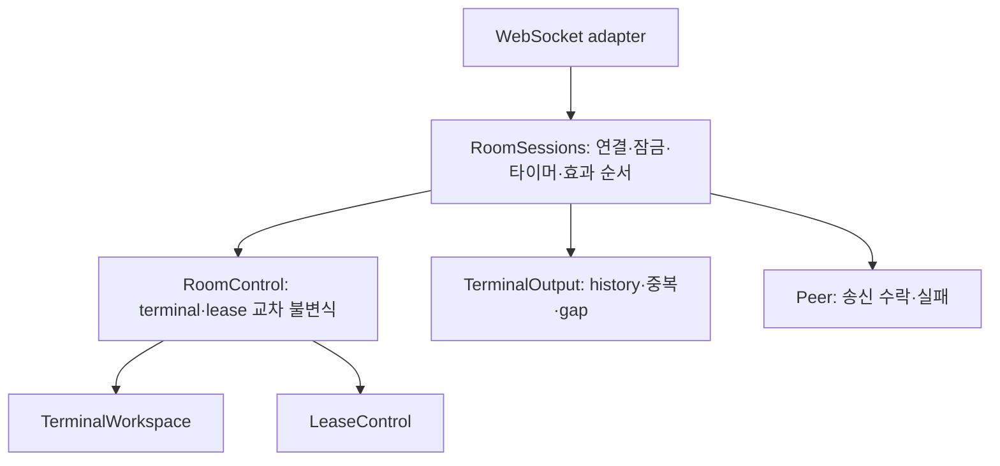

# Spring 모델링·소프트웨어 설계 리뷰 — P3k 이후

> `artifacts/` 경로는 로컬 보관 자료이며 공개 저장소에는 포함하지 않습니다. 수치와 명령은 작성 당시의 검증 기록입니다.

2026-09-21. 현재 Spring 소스와 기존 Node Room 모델, 리팩터링 로드맵, 테스트를 대조했다.
판정: **계층과 동시성 경계는 타당하다. 다만 shared 모드·영속성을 추가하기 전에 방의 도메인 규칙 소유자를 보강해야 한다.**
현재 범위에서 새 기능 결함을 확인한 것은 아니며, 아래 우선순위는 변경 비용과 모델의 보호 수준에 대한 판단이다.
이 리뷰에서는 제품 코드나 wire 계약을 변경하지 않았다.

후속: [2026-09-22 RoomControl 추출](2026-09-22-room-control-refactoring.md)에서 우선순위 1의
교차 규칙 소유자를 구현했다. [Terminal 생명주기 명시화](2026-09-22-terminal-lifecycle-refactoring.md)에서는
우선순위 2의 내부 상태 표현을 정리했다. 아래 내용은 두 변경 전 검토 기록이다.

## 우선순위 1 — Room의 불변식이 application에 남아 있다

근거:

- `backend/src/main/java/dev/ttyroom/application/RoomSessions.java:120`: Presence가 workspace, leases,
  output, peer/timer를 가진 members를 함께 보관한다. 실제 방 일관성 경계이지만 순수 도메인 root는 아니다.
- 같은 파일 `:322`: terminal 존재/open/exclusive 확인 후 LeaseControl을 호출한다.
- 같은 파일 `:372`: terminal 상태, 현재 host 연결, 입력 허용 보고, lease를 조합해 입력 허용 여부를 결정한다.
- 같은 파일 `:569`: host 만료 시 workspace 제거와 lease 제거를 application이 각각 호출한다.
- `backend/src/main/java/dev/ttyroom/domain/LeaseControl.java:23`: 열린 exclusive terminal인지는 호출자가
  확인해야 한다는 선행조건이 명시돼 있다.
- 기존 Node `legacy/node-server/src/domain/room.ts:237`의 acquireLease/isInputAllowed와 `:188`의
  removeHost는 이런 교차 불변식을 Room이 소유한다.

현재 모든 변경이 같은 방 monitor를 통과하므로 이것을 동시성 결함이나 외부 권한 우회로 단정할 수 없다.
문제는 shared 전환을 추가할 때 개발자가 application의 lease 획득·입력·만료 경로를 함께 기억해야 한다는 점이다.
예를 들어 shared에서도 기존 lease를 보존하되 다른 참여자의 입력은 허용해야 한다. 지금 구조에서는
mode 변경과 input 분기를 따로 맞춰야 한다. 다른 제거 경로도 workspace만 지우고 lease 정리를 빠뜨릴 수 있다.

권고: 순수 `RoomControl` 또는 `Room`을 두고 **terminal/lease를 함께 읽고 바꾸는 규칙**을 모은다.
예: acquireLease, decideInput, removeHost. 기존 TerminalWorkspace와 LeaseControl은 그 내부 협력자로 둔다.
RoomSessions는 인증된 연결 identity, 잠금, 타이머, peer 송신과 결과 순서를 맡는다.
host의 연결 사실과 보고된 입력 허용 상태의 소유권은 추출 시 명시하고, application/domain에 복제하지 않는다.

이것은 모든 메서드를 위임하는 facade 추출과 다르다. 제거·획득·허용 판단을 하나의 의미 있는 연산으로 만들고,
호출자가 workspace와 leases를 순서대로 조작하지 않아도 되게 하는 것이 완료 조건이다.
Room aggregate에 출력 history, socket, writer queue, timer를 넣지는 않는다. 방 단위 원자성은 유지한다.

## 우선순위 2 — 내부 생명주기와 외부 표시 상태의 의미를 더 명확히 한다

`TerminalWorkspace.java:59`의 Entry(runtimeId), `:65`의 confirmedOpenings,
`:70`의 생성 예약과 `:79`의 확인 처리에 상태 지식이 나뉘어 있다.

| 개념                  | 현재 표현               | 주의점                                                 |
| --------------------- | ----------------------- | ------------------------------------------------------ |
| 생성 요청을 예약했음  | OPEN + runtimeId=null   | OPEN이 PTY 생성 완료를 뜻하지 않는다                   |
| 실제 runtime을 연결함 | OPEN + runtimeId 존재   | 명시적인 생성 확인과 inventory 복구가 서로 다른 경로다 |
| 종료됨                | EXITED + runtimeId=null | runtimeId=null만 보고 예약 상태라고 판단하면 안 된다   |
| 생성 확인의 중복 보고 | confirmedOpenings       | runtime 생명주기와 별개인 확인 보고 이력이다           |

이 표현은 현재 캡슐화돼 있고 테스트가 있으며 Node v7의 예약 snapshot 계약도 보존한다.
따라서 당장 wire의 OPEN을 OPENING으로 바꾸자는 제안은 아니다. 내부에서 예약/연결/종료를 드러내는
enum 또는 sealed 상태를 검토하되 확인 보고 이력까지 하나의 상태로 억지로 합치지 않는다.
close/복구 경로가 추가될 때 nullable runtime 조합이 더 번지기 전에 정리하는 것이 적절하다.

Host에서도 `RoomSessions.Member.connected`는 현재 연결, `HostPresence.online`은 inventory/단절에 따른
표시 상태, `remoteInputAllowed`는 Connector의 보고다. 서로 독립된 사실이다. offline+allowed를 무조건
불법 상태로 만들거나 online을 입력의 새 필수조건으로 넣으면 현재 Node 계약이 달라진다.

용어상 lease는 terminal 입력 보유권과 fencing ID다. 별도의 expiresAt/자동 갱신 TTL lease가 아니며,
소유자의 단절 유예·반납·terminal 제거가 수명을 관리한다. 분산 lock이나 입력 실행 확인으로 설명하지 않는다.

## 우선순위 3 — Java 아키텍처 규칙을 반복 검증 가능하게 한다

현재 `.dependency-cruiser.cjs`는 TypeScript 경계를 검사한다. Java domain/application의 역방향 의존을
금지하는 자동 테스트는 확인되지 않았다. `backend/build.gradle`의 일반 컴파일만으로는 domain이 Spring을
import해도 막지 못한다. Spring 의존성은 같은 Gradle 프로젝트에 있기 때문이다.

이번에 JDK jdeps로 확인한 현재 바이트코드 의존:

- domain → domain, JDK
- application → application, domain, JDK
- domain/application → Spring/Jackson/adapter 의존 없음

지금 위반이 있다는 뜻은 아니다. 이후 Gradle 테스트에서 이 규칙을 자동 검사하도록 고정하는 것이 좋다.
패키지 검사나 architecture test 하나로 충분하며, 이를 위해 멀티 모듈/서브모듈 구조로 바꿀 필요는 없다.

## 유지할 패턴과 그 한계

| 현재 구조                                      | 설계상 의미                                  | 판단                                                                       |
| ---------------------------------------------- | -------------------------------------------- | -------------------------------------------------------------------------- |
| Peer + WS adapter/SocketSender                 | Ports and Adapters, Dependency Inversion     | 전송 실패·큐·I/O를 숨기는 실제 경계이므로 유지                             |
| sealed HostCommand/ParticipantCommand + switch | 타입이 있는 Command Message와 Message Router | 적절함. 메시지마다 execute 클래스를 만들 필요 없음                         |
| LeaseControl의 Acquired/AlreadyHeld/Denied     | 명시적인 도메인 결정                         | 변경/재시도/거절 의미가 드러남. boolean 하나보다 적절함                    |
| immutable snapshot과 byte 소유권               | 외부 변경에 의한 상태 오염 방지              | 유지. 모든 record가 자동으로 self-validating Value Object가 되는 것은 아님 |
| 방 monitor + 현재 세션 identity                | 방 단위 직렬화와 교체된 연결 차단            | 현재 단일 프로세스에 적합. Actor mailbox나 분산 lock 구현은 아님           |
| 출력 source seq와 history                      | 제한된 Idempotent Receiver·replay            | 입력 exactly-once나 durable log로 확대해석하지 않음                        |
| RoomNotice + RoomProtocol                      | application 전달 모델과 wire 변환            | 응답/Connector 명령/상태 알림의 합 타입. 전부 Domain Event로 부르지 않음   |

`RoomNotice.OpenTerminal`은 명령, `LeaseAccepted`는 직접 응답, `TerminalOpened`는 상태 알림이다.
현재 adapter로 전달할 결과를 하나의 sealed 타입으로 묶는 것은 합리적이다. 영속 domain event나 별도
소비자를 도입할 때 필요 범위만 분리하면 된다. 지금은 event bus나 event store가 없다.

shared/exclusive가 두 종류라는 이유만으로 Strategy 클래스를 만들 필요도 없다. 먼저 순수 도메인 연산의
exhaustive switch로 정책을 모으고, 정책군의 독립적인 확장이 실제로 필요해지면 분리한다.
단순 상태 전이는 enum/sealed 타입으로 표현할 수 있어 GoF State 클래스 계층도 필수는 아니다.
ID wrapper는 TerminalId/LeaseId 혼동을 막는 근거가 생기는 경계부터 선택하며 모든 문자열/숫자를 포장하지 않는다.

## 다음 변경의 구조와 순서

아래는 현재 구현이 아닌 권고 구조다.

1. 현재 exclusive/재접속/만료/송신 실패 계약을 유지하며 Room의 교차 규칙을 순수 모델로 추출한다.
2. shared 진입 시 lease 유지, 다른 참여자 입력 허용, exclusive 복귀 시 기존 보유권 복원 테스트를 먼저 추가한다.
3. 그 모델 경계 안에서 mode 전환을 구현한다. close/resize와 이후 저장 역시 그 불변식을 재사용한다.
4. Java 계층 의존 규칙을 CI에서 검사한다. 영속성에서는 save → commit → effects 경계를 별도로 완성한다.

## 검증 범위

이번 검토에서 Java 테스트를 재실행했다: **118개 통과, 실패·오류·skip 0개**.
`artifacts/migration-baseline/p3k-model-review/gradle.log`와 `jdeps.log`에 근거를 남겼다.
이전 P3k의 프로세스 E2E 결과와 이번 재실행을 구분한다. 이번에 E2E를 다시 실행하거나 성능/분산 환경을
검증하지는 않았다. 테스트 통과는 위 모델링 부채가 없다는 증명이 아니다.
