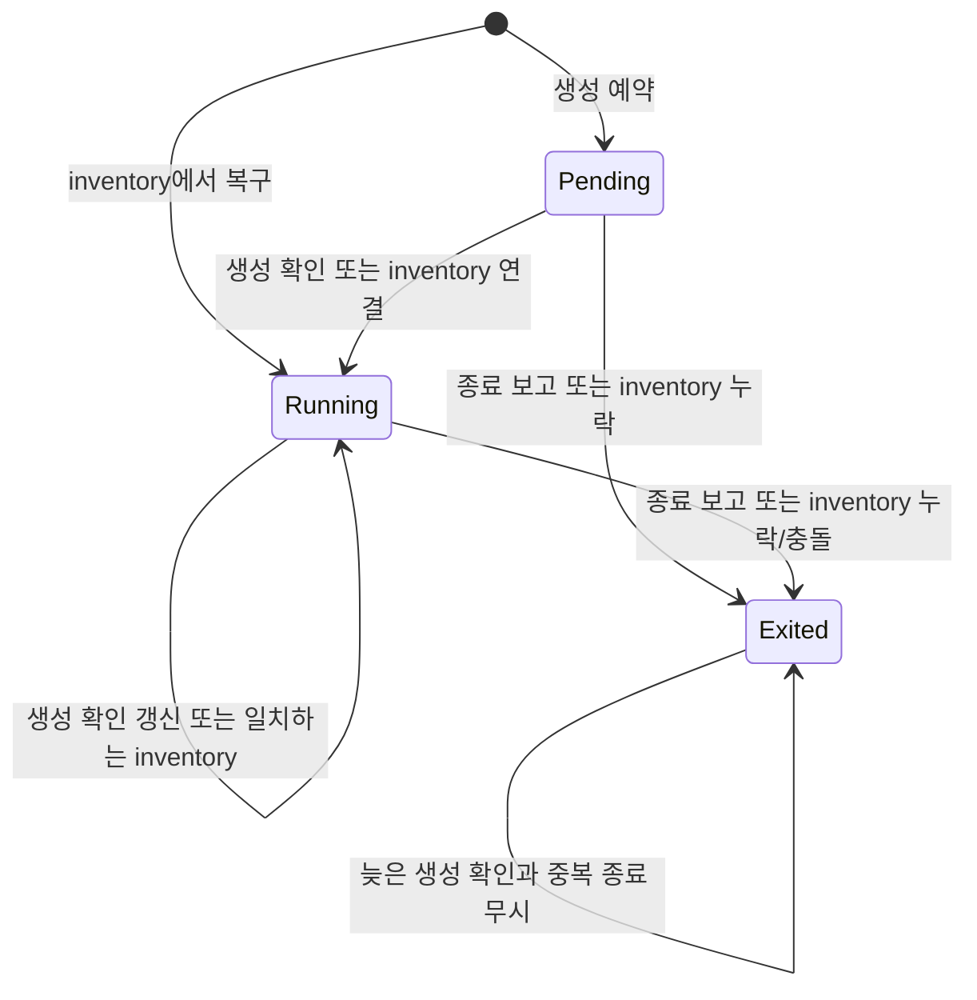

# TerminalWorkspace 생명주기 명시화 — P3m

> `artifacts/` 경로는 로컬 보관 자료이며 공개 저장소에는 포함하지 않습니다. 수치와 명령은 작성 당시의 검증 기록입니다.

2026-09-22. [모델링 리뷰](2026-09-21-spring-modeling-review.md)의 두 번째 개선이다.
[RoomControl 추출](2026-09-22-room-control-refactoring.md) 이후, 공개 계약을 유지하며
TerminalWorkspace 내부의 예약·runtime 연결·종료 표현을 정리했다.

## 변경 이유와 구조

이전 Entry는 외부 Terminal view와 nullable runtimeId를 보관했다. 예약은 OPEN + null,
실행은 OPEN + runtimeId, 종료는 EXITED + null로 표현해 여러 필드를 함께 해석해야 했다.
이제 private Lifecycle의 세 값으로 상태를 보관한다.

| 내부 상태          | 포함하는 정보                  | 외부 snapshot         |
| ------------------ | ------------------------------ | --------------------- |
| Pending            | 아직 runtime을 연결하지 않음   | OPEN, exitCode=null   |
| Running(runtimeId) | 연결된 runtime ID              | OPEN, exitCode=null   |
| Exited(exitCode)   | 최초 종료 결과 또는 알 수 없음 | EXITED, 해당 exitCode |

Entry가 상태 전이를 소유하고, snapshot에서만 기존 Terminal record를 만든다.
status/exitCode/runtimeId를 서로 독립된 가변 필드로 저장하지 않는다.
Running은 null runtime ID를 허용하지 않는다. 공개 WS 경계는 기존처럼 잘못된 runtime ID를 거절한다.
Pending도 외부에서는 OPEN이며 입력/출력 가능 여부의 기존 의미를 바꾸지 않았다.

## 보존한 전이 규칙

- 예약의 inventory는 보고된 runtime을 연결한다. 이미 연결된 runtime은 ID가 같아야 유지한다.
- 생성 확인은 살아 있는 terminal의 runtime을 최신 값으로 갱신할 수 있다. inventory의 충돌 정책과 다르다.
- 종료된 terminal은 늦은 확인이나 inventory로 다시 열리지 않는다. 보고된 PTY는 기존대로 닫도록 지시한다.
- 최초 exitCode를 유지한다. null로 종료된 뒤 늦은 종료 코드가 와도 덮어쓰지 않으며 큰 정수 범위도 유지한다.
- metadata 수정은 생명주기를 바꾸지 않는다. 이전 Terminal snapshot과 reconciliation 결과는 불변 값이다.
- 소유 host 확인, ID 발급/소진, 다른 host 보호, inventory 순서와 중복 ID의 마지막 보고 우선 규칙을 유지한다.

confirmedOpenings는 생명주기와 분리했다. inventory가 runtime을 연결/복구한 사실과
명시적인 생성 확인을 알린 이력은 다르다. Pending에서 연결된 경우든 Connector에서 복구된 경우든,
첫 생성 확인은 한 번 알리고 이후 확인은 runtime만 갱신한다. 내부 attachRuntime은 이 이력을 변경하지 않는다.

## 설계 재검토

- 상태 구현마다 서비스·인터페이스를 분리하는 GoF State 구조를 도입하지 않았다.
  작은 private sealed 타입과 exhaustive switch로 한 파일에서 전이를 읽을 수 있다.
- Entry의 가변 상태는 TerminalWorkspace 내부에만 있다. 외부에는 새 불변 snapshot만 반환한다.
  모든 변경은 계속 기존 방 monitor 아래에서 수행되며 새 잠금이나 공유 상태를 추가하지 않았다.
- production 변경은 TerminalWorkspace 한 파일에 한정된다. RoomControl, RoomSessions,
  adapter, Connector, TypeScript protocol과 E2E의 기대 결과를 바꾸지 않았다.
- shared 모드, 참여자 close/resize와 영속 저장은 이번 범위에 포함하지 않는다.
  Java 계층 규칙의 자동 검사도 후속 작업으로 남아 있다.

## 검증

기존 132개에 특성화 시나리오 6개를 추가하고 **기존 구현에서 138개 통과**를 확인한 다음 구조를 변경했다.
추가 검증은 예약/예약 inventory 연결/복구 각각의 첫 확인과 중복 확인, 예약 metadata 후 runtime 연결,
실행 상태의 종료 후 늦은 보고·inventory, inventory 유실 이후 알 수 없는 exitCode 보존이다.
기존 테스트의 기대 결과를 수정하지 않았다. 각 테스트는 준비 → 행동 → 결과 순서이며 내부 Lifecycle을 직접 검사하지 않는다.

- 리팩터링 후 Java 138개 통과: 실패·오류·skip 0개.
- bootJar 빌드, 변경 Java 포맷 검사 통과.
- jdeps: domain → JDK, application → domain/JDK. Spring/Jackson/adapter 역방향 의존 없음.
- 실제 Spring JAR 공통 E2E **111개 / 8개 파일 통과**. 생성 예약 snapshot, 중복/늦은 확인,
  inventory 복구/충돌, 메타데이터와 exclusive 입력을 포함한다. 실제 Connector PTY 셸 실행도 통과했다.

근거는 `artifacts/migration-baseline/p3m-terminal-lifecycle/`에 있다.
변경 전 `before/src`와 `java-characterization.log`, 변경 후 `java-refactoring.log`, `gradle.log`,
`java-results.json`, `java-contract.log`, `jdeps.log`, `java-format.log`를 남겼다.
JAR 빌드가 끝난 뒤 E2E를 시작했고 실행 중 JAR을 다시 만들지 않았다.
이번 검증은 로컬 회귀 확인이며 성능/장시간 부하, 영속 복구, 전체 브라우저 협업을 검증한 것은 아니다.
