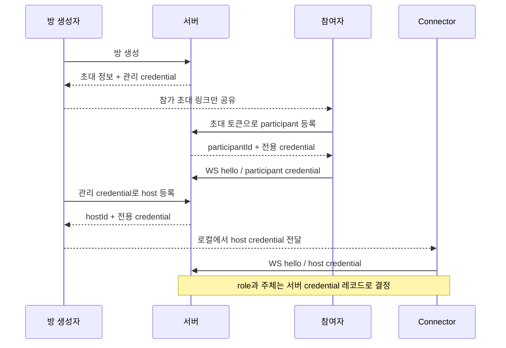

# 인증 경계 보강안: 초대·주체·재접속 증명 분리

> `artifacts/` 경로는 로컬 보관 자료이며 공개 저장소에는 포함하지 않습니다. 수치와 명령은 작성 당시의 검증 기록입니다.

상태: 내부 credential 발급·취소 모델과 원자적 저장·복원을 구현했다(T9.1).
HTTP 등록·취소, 관리 credential과 WebSocket 입장은 후속 설계다. wire는 현재 v7 그대로다.
목표는 계정 서비스를 만드는 것이 아니라, 같은 초대 링크를 가진 클라이언트가
다른 participant나 host의 식별자를 임의로 사용하는 문제를 막는 것이다.

## 선택

**방 초대 토큰은 신규 participant 등록에만 사용하고, 실제 연결은 서버가 발급한
주체별 credential로 인증한다. host 등록은 방 생성자에게만 허용한다.**

사람의 실명·계정 인증이 아니라 발급된 자격 증명의 소유를 증명하는 모델이다.
credential이 유출되거나 페이지에서 탈취되면 그 주체로 행동할 수 있다.
nickname, clientId, hostId 자체는 비밀이나 인증 수단이 아니다.

| 값                     | 발급 대상과 용도                                          | 방 참가자에게 공개되는가         |
| ---------------------- | --------------------------------------------------------- | -------------------------------- |
| 방 초대 토큰           | 새 participant를 등록할 수 있는 링크                      | 초대된 사람에게 전달             |
| 관리 credential        | 방 생성자에게만 반환. host 등록·자격 취소 권한            | snapshot·초대 링크에는 넣지 않음 |
| participant credential | 서버가 만든 participantId에 결합. 연결·재접속 인증        | 해당 클라이언트만 보유           |
| host credential        | 관리자가 등록한 hostId에 결합. Connector 연결·재접속 인증 | 해당 Connector에 전달            |

모든 credential은 추측하기 어려운 무작위 opaque 값으로 만들고 서버에는 digest를 저장한다.
JWT는 이번 범위에 필요하지 않다. 서버가 어차피 방별 등록·취소 상태를 소유하므로
서명 토큰과 별도의 취소 목록을 함께 관리할 이유가 없다.

## 제안 흐름

아래 HTTP 경로와 payload는 구현할 계약의 초안이며 현재 API가 아니다.
관리 credential은 URL이 아닌 Authorization 헤더로 전달한다.

1. `POST /api/rooms`: 기존 방 초대 정보에 더해 관리 credential을 생성자에게만 반환한다.
   브라우저는 관리 credential을 일반 초대 링크에 포함하지 않는다.
2. `POST /api/rooms/{roomId}/participants`: 초대 토큰과 표시 이름을 받아 새 participantId와
   participant credential을 발급한다. 요청자가 기존 participantId를 선택하는 필드는 제공하지 않는다.
3. `POST /api/rooms/{roomId}/hosts`: 관리 credential을 확인한 뒤 새 hostId와 host credential을 발급한다.
   브라우저의 Add Host 흐름은 이 권한이 있을 때만 등록 명령을 제공한다.
4. Connector에는 host credential만 전달한다. 참여 초대 링크만으로 host에 가입할 수 없게 한다.
   최초 로컬 범위에서는 인자·셸 기록 노출을 피할 수 있는 stdin 입력 경로를 제공하고,
   process 메모리에 보관한다. 파일 영구 보관과 키체인 연동은 별도 범위다.
5. WebSocket hello는 roomId와 주체 credential을 제출한다. 서버가 credential 레코드에서
   role과 subjectId를 결정한다. 클라이언트가 보낸 role/clientId로 인증 결과를 덮어쓸 수 없다.
6. 재접속은 동일 credential로 같은 주체를 인증한 경우에만 기존 연결을 교체한다.
   인증 실패는 현재 연결·lease·PTY 상태를 변경하지 않는다.

## 상태·수명·실패 계약

- credential 발급은 레코드 저장 성공 후 응답한다. 저장 실패 시 인증 가능한 credential이 남지 않는다.
  저장 성공 후 응답이 유실되면 사용하지 못하는 등록이 남을 수 있다. 자동 재시도에서
  exactly-once 발급을 주장하지 않는다. 관리 화면의 목록·취소로 정리할 수 있게 한다.
- 방이 삭제되면 그 방의 credential도 제거한다. 연결 grace 만료와 credential 취소는 구분한다.
  credential을 보유한 정상 재접속을 단순 일시 단절 때문에 다른 주체로 만들지 않는다.
- 관리자가 특정 participant/host credential을 취소하면 새 연결을 거절하고 현재 연결도 정리한다.
  인증과 취소는 같은 방별 명령 순서에서 판정해, 인증 중 취소된 주체가 뒤늦게 붙지 못하게 한다.
- 취소는 이미 실행된 셸 명령을 되돌리지 않는다. host 연결을 끊는 것과 로컬 PTY 프로세스를
  반드시 종료시키는 것은 다르다. Connector의 로컬 종료·Kill Switch는 계속 독립적으로 유지한다.
- credential은 welcome snapshot, room-event, 오류, toString, 진단 로그에 포함하지 않는다.
  발급 응답은 `Cache-Control: no-store`를 사용한다.
- 브라우저의 participant credential은 탭 단위 수명으로 보관한다. 기존 탭 복제 감지로 새
  participant를 발급받도록 하되, 의도적인 credential 복사까지 신원 보호로 주장하지 않는다.
- 관리 credential을 잃으면 계정 기반 복구는 제공하지 않는다. MVP에서는 새 방을 생성한다.
  자동 만료 시간과 회전 정책은 구현 전 별도 값으로 확정한다. 이 문서에서 숫자를 임의로 약속하지 않는다.

## 권한과 인증을 구분한다

이 변경은 “누구의 연결인가”를 보호한다. participant가 셸을 어느 범위까지 조작할 수 있는지는
별도 ACL이다. 기존 협업 동작을 유지하는 첫 단계에서는 모든 participant가 현재 허용된
mode 변경·생성·종료 요청을 할 수 있다. **View only가 영구 읽기 전용 권한이 되는 것은 아니다.**

정책 확장이 필요하면 observer/operator/admin을 별도 권한으로 설계한다. 현재 host/participant는
프로토콜 역할이며 관리자·일반 사용자 등급과 같지 않다.

## 대안 비교

| 대안                                     | 선택하지 않은 이유                                                                                             |
| ---------------------------------------- | -------------------------------------------------------------------------------------------------------------- |
| clientId를 더 긴 UUID로 변경             | ID는 snapshot으로 공유된다. 비밀 없이 ID를 알아맞히기 어렵게 하는 것은 소유 증명이 아니다.                     |
| host용 방 공통 토큰만 추가               | 참가자의 host 진입은 막지만 같은 host 토큰 사용자끼리 특정 hostId를 사칭할 수 있다. participant 사칭도 남는다. |
| 기존 연결이 있으면 같은 ID를 무조건 거절 | 정상 재접속·연결 교체를 깨뜨리고, 연결이 끊긴 주체의 소유권도 증명하지 못한다.                                 |
| OAuth·사용자 계정부터 도입               | 계정 복구·세션·권한 관리 범위가 크게 늘어난다. 현재 문제는 주체별 credential로 먼저 분리할 수 있다.            |

## 기존 코드의 변경 경계

credential 검증 결과는 role과 subjectId를 포함하는 불변 인증 결과로 전달한다.
RoomSessions는 검증된 결과만 받아 연결을 조정하며 credential digest·HTTP 표현을 알 필요가 없다.
별도의 범용 인증 프레임워크나 이벤트 버스는 만들지 않는다.

| 영역                       | 필요한 변경                                                                   |
| -------------------------- | ----------------------------------------------------------------------------- |
| RoomDirectory / 저장소     | 관리·주체 credential 레코드, digest 검증·취소, 원자적 저장 및 방 삭제 시 정리 |
| HTTP 어댑터                | 등록·취소 API, 비밀 응답과 오류 정책                                          |
| RoomSessions / WS 어댑터   | 검증된 주체로 입장·교체. 미인증 role/clientId를 사용하지 않음                 |
| React RoomApi·RoomIdentity | 최초 등록과 credential 재사용, 탭 복제 시 새 등록, 관리 전용 host 등록 UI     |
| Connector CLI·Session      | host credential 입력, 프로세스 내 보관과 재접속                               |
| protocol·공통 E2E          | 새 hello·등록 계약, 거절·교체·취소 경합 검증                                  |

## 이행과 첫 TDD 단계

v7의 `token + role + clientId` hello를 그대로 허용하면 보호를 우회할 수 있다.
따라서 새 인증은 protocol major 변경(후보 v8)과 저장 형식 이행을 함께 다룬다.
이 설계만으로 현재 `PROTOCOL_VERSION`을 올리지 않는다.
기존 방에는 관리·주체 credential이 없으므로 조용히 임의 발급하지 않는다.
토이 프로젝트의 첫 전환은 새 저장 파일·새 방을 사용하고 기존 파일은 유지한다.
Node 비교 구현은 v7 회귀 기준으로 남기며 v8 테스트와 v7 테스트를 구분한다.

첫 구현은 UI나 wire 변경 전에 **credential 검증 경계**를 독립적으로 검증하는 작은 단계다.

1. RED: 다른 방, 다른 역할, 다른 주체, 취소된 credential이 인증되지 않는 테스트.
2. GREEN: 무작위 credential 발급·digest 저장·검증·취소의 최소 모델.
3. RED: 저장 실패 시 발급·취소가 메모리에만 반영되지 않는 테스트.
4. GREEN: 기존 save-before-commit 경계에 연결.
5. 다음 단계에서 HTTP 등록과 v8 입장을 연결한다. 연결 전 단계는 “현재 사칭 문제 해결”로 보고하지 않는다.

완료 조건은 유효한 주체만 자신의 연결을 교체할 수 있고, 초대 토큰만으로 host 접속이나
기존 participant 교체를 할 수 없으며, 취소 후 재접속이 거절되는 것이다.
host inventory·PTY 복구와 participant lease 재접속 계약도 새 인증에서 다시 검증해야 한다.

[현재 보안 모델](SECURITY_MODEL.md)과 [현재 wire v7](../protocol/PROTOCOL.md)은
구현된 동작의 기준으로 유지한다. 아래 내부 모델·저장 외의 연동 항목은 아직 구현되지 않았다.

## 첫 구현 기록: 내부 credential 모델

첫 단계의 `RoomCredentials`는 방마다 별도로 생성하는 package-private 모델이었다. 역할과 UUID 식별자를
서버에서 발급하고, 24바이트 무작위 비밀값을 한 번 반환한다. 모델에는 SHA-256 digest만 남긴다.
인증 호출은 비밀값만 받으며, 요청자가 역할이나 식별자를 지정하는 인자가 없다.
주체별 취소는 다른 등록을 보존하며 반복 호출할 수 있다. 발급 결과의 `toString()`은 비밀값을 가린다.

발급·인증·취소는 모델 인스턴스 안에서 직렬화한다. 인증은 등록된 주체 수에 비례하는 순회이며,
개별 digest 비교에 `MessageDigest.isEqual`을 사용한다. 전체 조회의 일정한 실행 시간을 보장하는 것은 아니다.
범용 저장소 인터페이스나 인증 프레임워크는 이 단계에서 추가하지 않았다.

`RoomCredentialsTests`의 6개 실행 사례는 역할별 인증 결과, 다른 방의 거절, 선택적·반복 취소,
공개 ID·누락·알 수 없는 비밀값의 거절, 독립 발급과 출력 시 비밀값 가림을 검증한다.
준비 → 행동·관찰 → 마지막 assertion 순서를 유지한다.

검증 기록은 `artifacts/identity-model/`에 있다.

- RED: 컴파일 가능한 미구현 placeholder에서 6개 모두 `UnsupportedOperationException`으로 실패했다.
  기존 운영 코드의 결함을 assertion으로 재현한 기록은 아니다. 변경 전 소스도 보관했다.
- GREEN: 구현 후 Java 전체 361개 통과, 실패·오류·건너뜀 0개.
- 여섯 사례를 한 묶음으로 진행했으며, 행동별로 각각 RED → GREEN을 반복한 것은 아니다.
- HTTP·WebSocket·RoomDirectory에는 아직 연결하지 않아 E2E는 이번 단계에서 재실행하지 않았다.

이 첫 단계에서는 저장 연동이 없어 재시작 시 credential이 사라졌다. 아래 T9.1에서 그 경계를 연결했다.
현재 v7의 사칭 문제와 연결 종료·취소/입장의 경합·등록 권한은 후속 작업으로 남아 있다.

## T9.1: 발급·취소의 저장과 복원

`RoomDirectory`의 내부 발급·취소 진입점은 기존 방별 `execute` 명령 순서를 사용한다.
`RoomOperation.changeCredentials`는 별도 credential draft를 만들고 전체 방 레코드를 저장한 뒤
확정한다. 저장 중 상태 monitor는 놓으므로 인증 조회는 이전 확정 상태를 읽는다.
저장 실패 시 draft를 버리고 성공 결과를 반환하지 않는다. 반복 취소는 저장을 생략한다.

일반 workspace 변경도 현재 credential 레코드를 함께 저장한다. credential 변경은 workspace를
복제·교체하지 않으며, 방 삭제 뒤 남은 내부 참조로 credential을 발급해 방을 되살리지 못한다.
발급·취소는 저장소 종료 drain에도 포함된다. 인증 조회는 확정 상태의 조회일 뿐, 조회 결과로
나중에 WebSocket을 붙여도 된다는 허가가 아니다. 취소와 실제 입장의 원자성은 T9.3/T9.5에서 다룬다.

`RoomCredentials`의 변경 메서드와 생성자는 application 내부에 둔다. SQLite 어댑터가 읽고 쓰는
`Subject`·`Stored` 불변 값과 그 역할 enum만 공개한다. 저장 목록은 복사하고 같은 주체 ID 또는
같은 digest의 중복을 거절한다. digest와 비밀값은 문자열 진단에서 가린다.

### 저장 표현

- credential이 없으면 기존 `schemaVersion: 1` 표현을 유지하고, v1 읽기는 빈 목록으로 복원한다.
- 하나 이상이면 `schemaVersion: 2`와 `credentials: [{subject: {role, id}, digest}]`를 기록한다.
- 마지막 credential 취소 후에는 빈 목록을 나타내는 v1으로 저장할 수 있다. 취소된 비밀값이 다시 인증되는 것은 아니다.
- 역할·UUID·digest 형식, 중복 주체/digest, 누락·알 수 없는 필드를 검사한다. 오류 응답에 원본 레코드나 파서 cause를 넣지 않는다.
- 비밀값은 저장하지 않는다. 방 상태와 credential은 같은 SQLite row의 한 번의 교체로 저장한다.
- Node 참조 구현은 v2 레코드를 지원하지 않는다. **저장 버전 2와 wire v8은 서로 다르며**, 이 변경은 v7 입장 정책을 바꾸지 않는다.

### 검증과 작업 과정

- 발급·취소 저장 실패 2개: 저장 없는 초기 내부 진입점에서 assertion 실패를 확인한 뒤 저장 후 확정 구현으로 통과시켰다. 기존 공개 API의 버그 재현은 아니다.
- 파일 재열기 5개: 기존 codec이 credential을 저장하지 않아 4개 실패, 마지막 취소 후 빈 상태 1개는 처음부터 통과했다. v2 저장·복원 후 모두 통과했다.
- 리뷰에서 서로 다른 주체의 동일 digest를 허용하는 결함을 1개 실패 테스트로 확인한 뒤 중복 거절을 추가했다.
- 저장 대기 중 이전 인증 상태 유지, 반복 취소의 저장 생략, 삭제된 방의 인증·발급 거절, 손상 레코드 거절을 보강했다.
- SQLite 검증은 파일을 닫고 새로운 RoomDirectory/저장소로 여는 Java 테스트다. credential 전용 HTTP·프로세스·브라우저 인증 검증은 아직 아니다.
- Java 전체 380개 통과. 코드·계층 검사와 로컬 실행 근거는 [검증 기록](VERIFICATION.md)에 연결한다. 원본은 `artifacts/credential-persistence/`에 보관한다.

**v7의 사칭 문제는 아직 해결되지 않았다.** 실제 HTTP·WS 요청은 이 내부 credential을 사용하지 않는다.
다음은 T9.2에서 관리 credential과 participant/host 등록 API의 권한·비밀 응답 계약을 구현하는 단계다.
