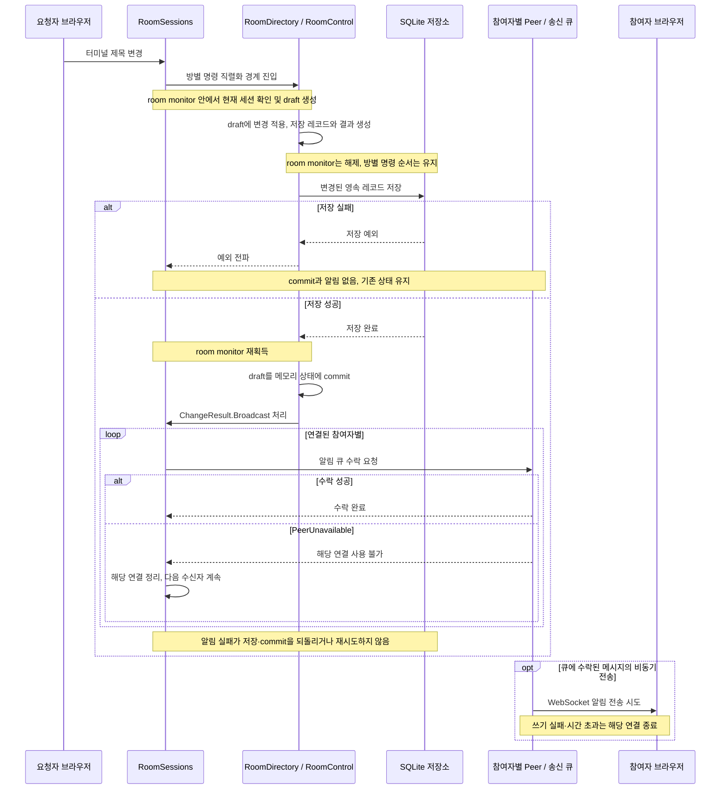

# 상태 변경과 실패 경계

실행 위치와 통신 방식은 [README 시스템 구성](../README.md#시스템-구성)을 따른다.
아래 시퀀스는 **SQLite 저장을 사용하는 방에서 터미널 제목이 실제로 변경되는 경우**다.
모든 요청이 DB 저장이나 broadcast를 거친다는 뜻은 아니다.

송신 worker는 큐 수락 직후부터 병행 실행할 수 있다. 도식 하단의 비동기 전송은
별도 책임을 보여주기 위한 것이며, 모든 수신자의 큐 수락이 끝날 때까지 대기한다는 뜻은 아니다.
큐 수락이나 소켓 쓰기 완료는 브라우저가 메시지를 처리했다는 확인이 아니다.

## 읽을 때 중요한 구분

| 경계               | 보장과 범위                                                                                                  |
| ------------------ | ------------------------------------------------------------------------------------------------------------ |
| 방별 명령 순서     | 같은 방의 제어 변경은 순서대로 처리한다. 다른 방은 독립적으로 진행할 수 있다.                                |
| 짧은 room monitor  | draft 생성과 commit을 보호한다. 저장 대기 중에는 monitor를 놓아 실시간 경로가 확정된 상태를 읽을 수 있다.    |
| 저장과 commit      | 저장이 실패하면 메모리 변경과 후속 알림을 실행하지 않는다. 영속 레코드가 바뀌지 않으면 저장 호출은 생략한다. |
| commit과 알림      | 알림은 commit 후 처리한다. 둘을 하나의 원자적 트랜잭션으로 묶은 구조는 아니다.                               |
| 예상된 전송 실패   | 수신자별 PeerUnavailable은 해당 연결만 정리한다. 이미 확정한 상태는 유지한다.                                |
| 예상 밖 예외       | 구현 오류는 전파한다. 이 경우 나머지 수신자에게 알림을 계속한다는 보장은 없다.                               |
| 오래된 연결의 정리 | 현재 등록된 Member와 동일한지 확인하여 교체된 새 연결을 보호한다.                                            |

저장 대기 중 연결이 끊어지더라도 이미 시작한 durable 결정을 commit할 수 있다.
eligibility는 저장 뒤 다시 검사하지 않으며, 후속 효과가 현재 연결의 전달 가능 여부를 판단한다.
자세한 조건은 아래 코드와 저장 중 연결 교체 테스트를 기준으로 한다.

입력·출력·cursor는 위 durable 저장 순서를 그대로 거치지 않는다. 특히 PTY 입력은
불확실한 실행을 자동 재시도하지 않으며 exactly-once 실행을 보장하지 않는다.
프로세스가 commit과 알림 사이에 종료될 때의 지속적 전달을 위한 outbox도 구현하지 않았다.

## 코드와 검증 근거

- [RoomDirectory](../backend/src/main/java/dev/ttyroom/application/RoomDirectory.java): `execute`, `RoomOperation.changeIf`의 직렬화·저장·commit 계약.
- [RoomSessions](../backend/src/main/java/dev/ttyroom/application/RoomSessions.java): `change`, `publish`, `broadcast`, `disconnected`의 효과와 연결 동일성 처리.
- [SocketSender](../backend/src/main/java/dev/ttyroom/adapter/ws/SocketSender.java): 비동기 송신·큐 한도·시간 초과·연결 종료.
- [RoomPersistenceTests](../backend/src/test/java/dev/ttyroom/application/RoomPersistenceTests.java): 저장 대기·실패와 commit 후 전송 실패.
- [저장 후 알림 검토](WORK_LOG.md#자원-수명과-실패-처리): 추가한 계약 테스트와 로컬 검증 범위.
- [백엔드 상세 설계](../backend/ARCHITECTURE.md): 현재 모듈의 책임, 동시성·저장·전달 계약.
- [포트폴리오 설명](PORTFOLIO.md): 선택·대안·한계 및 시연 흐름.
