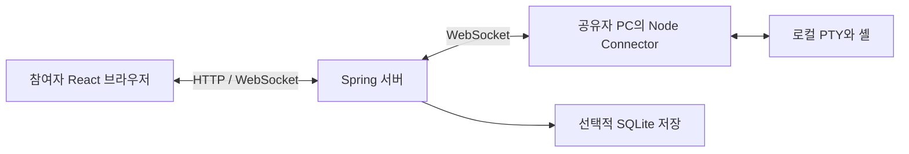

# TTYRoom: 협업 터미널의 상태·실패 계약을 유지한 Spring 전환

TTYRoom은 한 사람이 실행한 로컬 셸을 여러 참여자가 브라우저로 함께 보고,
입력 권한을 받아 조작하는 토이 프로젝트다. React 화면, Spring 서버,
사용자 PC의 Node Connector로 구성된다. Connector가 실제 PTY를 실행한다.

이 문서는 저장소에서 확인할 수 있는 설계와 로컬 검증을 정리한다.
개인 기여 비율, 운영 사용자 수, 배포 성과를 증명하는 자료는 아니다.

## 프로젝트를 짧게 소개한다면

> 기존 TypeScript 협업 서버를 Spring으로 옮기면서 외부 동작을 공통 E2E로 비교했습니다.
> 핵심은 프레임워크 문법보다, 방 상태의 저장·확정·알림 순서와 연결 교체 시의
> 동시성 계약을 유지하는 일이었습니다. 저장 실패와 전송 실패를 구분하고,
> 실제 Connector·PTY·브라우저로 재접속과 복구를 검증했습니다.

## 왜 Spring으로 전환했는가

목표는 Java/Spring 학습과 백엔드 설계·테스트를 설명할 수 있는 포트폴리오다.
Spring 채택 자체가 성능 개선을 입증하지는 않는다. 처리량이나 지연시간의
Node 대비 우위는 측정하지 않았다.

전환 과정에서 Java의 명시적인 동시성 제어, 타입으로 표현한 명령·결과,
프레임워크 어댑터와 업무 모델의 분리를 다뤘다. 기존 Node 구현을 비교 기준으로
남겨 두어 언어 변경과 외부 계약 변경을 구분할 수 있게 했다.

React는 브라우저 UI를, Connector는 사용자 컴퓨터의 PTY를 소유한다.
둘까지 Java로 옮기는 것은 서버 전환과 독립적인 재작성이다. 현재 학습 범위에서는
검증된 실행 경계를 유지하고 HTTP/WebSocket 서버를 전환하는 선택을 했다.



기본 Spring 실행은 loopback 바인딩을 사용하는 로컬 구성이다.
여러 사람이 인터넷에서 사용하는 배포·접근 제어 구성을 완료했다는 뜻은 아니다.
[실행 안내](../README.md)를 먼저 따라갈 수 있다.

## 판단 1: 방의 변경을 한 경계에서 직렬화한다

[상태 변경 시퀀스 도식](ARCHITECTURE.md)에서 정상 처리와 저장·알림 실패 경로를 함께 볼 수 있다.

**문제.** 터미널 생성, 모드 변경, host 복구가 서로 다른 경로에서 상태를 변경하면
저장 실패 후 ID가 소비되거나, 저장되지 않은 상태가 참여자에게 보일 수 있다.

**선택.** Node의 room별 queue와 stage/save/commit 계약을 Java에서도 유지했다.
`RoomDirectory.RoomOperation.changeIf`가 변경 가능 여부 확인, draft, 저장,
commit과 후속 효과 실행 순서를 소유한다. 저장 대기 중에는 짧은 room monitor를
놓지만 방별 명령 직렬화는 유지한다. 실시간 입력·출력·cursor는 별도 경계에서
확정된 상태를 사용한다.

**대안과 비용.** 각 use case가 개별적으로 저장·알림 순서를 조합하면 같은 실패 지식을
반복해야 한다. 반대로 네트워크 I/O까지 방 잠금 안에서 기다리면 느린 수신자가 방을
막을 수 있다. 전송은 비동기 큐 수락 계약으로 분리했다.

**검증.** 저장 gate를 이용해 대기·실패를 재현하고, 실패 시 이전 상태와 ID가 유지되며
알림이 나오지 않는지 확인한다. 다른 방과 실시간 경로가 진행 가능한지도 검사한다.

- [Java 변경 경계](../backend/src/main/java/dev/ttyroom/application/RoomDirectory.java)
- [Node 비교 구현](../legacy/node-server/src/usecases/room-registry.ts)
- [저장·동시성 테스트](../backend/src/test/java/dev/ttyroom/application/RoomPersistenceTests.java)

## 판단 2: 저장 성공과 전달 성공을 구분한다

**문제.** 저장한 뒤 수신자 하나의 연결이 끊어졌다고 저장을 재시도하거나 되돌리면
이미 확정한 상태와 다른 참여자가 관찰한 결과가 어긋난다.

**선택.** `ChangeResult`로 Reply/Broadcast/HostRequest 등의 효과를 표현하고 commit 후
처리한다. 예상된 `PeerUnavailable`은 해당 수신자를 정리하고 다음 수신자로 진행한다.
예상 밖 구현 예외는 숨기지 않는다. 이 경우 전체 알림 완료까지 보장하지는 않는다.

**검증.** 알림 실패 후 저장 상태와 메모리 상태가 동일하고 저장은 한 번만 발생하는지,
정상 수신자에게 알림이 이어지는지 검사한다. 교체된 연결의 늦은 disconnect와 expiry가
새 연결을 제거하지 않는 테스트도 있다.

- [세션과 효과 처리](../backend/src/main/java/dev/ttyroom/application/RoomSessions.java)
- [송신 큐와 시간 초과 처리](../backend/src/main/java/dev/ttyroom/adapter/ws/SocketSender.java)
- [검토 및 테스트 근거](2026-09-28-post-commit-delivery.md)

이는 메모리 내 후속 효과다. commit과 전송 사이 프로세스가 종료되면 알림이 유실될 수 있다.
지속적 전달이 요구될 때 outbox 등을 검토할 수 있지만 현재 구현했다고 설명하지 않는다.

## 판단 3: 수명주기와 중복 상태는 소유한 모듈에서 해결한다

ConnectorSession은 현재 연결과 재시도 타이머를, PtyManager는 실제 셸의 종료를 소유한다.
close 요청과 실제 exit을 구분하고, 남은 출력을 내보낸 뒤 종료를 보고한다.
프론트엔드 런타임은 구독·컨트롤러·타이머 정리를 소유한다.

출력 순번은 앱 Map과 replay buffer에서 중복 관리하던 상태를 버퍼 기준으로 일원화했다.
반면 공유 geometry의 마지막 반영값은 로컬 이동을 무관한 이벤트가 덮어쓰지 않도록
필요한 정보여서 유지했다. Map 개수나 파일 길이보다 정보의 의미와 소유권을 기준으로 삼았다.

- [Connector와 PTY](../connector/src/pty-manager.ts)
- [프론트엔드 런타임](../web/src/app/room-app.tsx)
- [유지·변경 판단 비교](2026-09-28-production-boundaries.md)

## 테스트로 설명할 수 있는 실제 사례

| 사례                | 실패 또는 변경 전 상태                                                         | 수정과 확인                                               | 작업 성격                |
| ------------------- | ------------------------------------------------------------------------------ | --------------------------------------------------------- | ------------------------ |
| Connector 생성 보고 | 생성 완료 보고의 동기 예외를 spawn 실패로 처리해 살아 있는 PTY를 closed로 보고 | 전송 예외를 주입한 테스트 실패 후 catch를 PTY 생성에 한정 | RED → GREEN 오류 수정    |
| 종료 후 join        | dispose한 런타임이 새 세션을 생성해 기존 종료 경로로 정리되지 않음             | 호출 순서로 재현 후 disposed 검사 추가                    | RED → GREEN 오류 수정    |
| 출력 순번 중복      | 앱과 replay buffer가 같은 순번을 별도로 관리                                   | 용량 초과 후 순번 지속 계약을 먼저 고정하고 중복 Map 제거 | GREEN → REFACTOR → GREEN |
| 저장 후 알림 실패   | 의도한 동작은 이미 구현되어 있으나 직접 검증 부족                              | 저장·메모리 상태·저장 횟수·다른 수신자의 관찰을 검사      | 특성 테스트 보강         |

[Connector 실패 기록](2026-09-28-connector-failure-boundary.md)과
[런타임 종료 기록](2026-09-28-runtime-lifecycle.md)에 실패 확인과 수정 범위를 남겼다.
두 오류는 테스트로 재현한 것이며 실제 운영 장애 사례로 표현하지 않는다.

테스트는 준비·행동·관찰·검증을 구분한다. fixture는 자원 수명과 준비 완료를 책임지고,
기대 결과는 테스트 본문에서 읽을 수 있게 둔다. 이전 테스트의 상태에 의존하지 않는다.
실제 셸 검증은 입력 echo를 성공으로 오인하지 않도록 명령 원문에 없는 실행 결과를 관찰한다.
[작성 가이드와 예시](CODE_STYLE.md)를 함께 읽는다.

## 검증 수준과 남은 한계

[보안 모델](SECURITY_MODEL.md)은 토큰·역할·셸 실행의 신뢰 경계를 설명한다.
clientId 기반 재접속 보호는 사용자 신원 인증과 다르며, 현재의 View only는 읽기 전용 ACL이 아니다.

2026-09-28 로컬 검증 기록은 Java 355개, TypeScript 단위 544개,
Chromium 브라우저 E2E Node/Spring 각각 38개다. 서로 다른 단계의 실행 결과이며
한 번에 모두 실행한 단일 CI 결과가 아니다. 숫자는 검증 범위를 찾는 보조 정보이지 품질 점수가 아니다.

브라우저 결과는 [검증 범위와 로컬 기록 안내](VERIFICATION.md),
Java 결과는 [저장 후 알림 검토](2026-09-28-post-commit-delivery.md)에 연결되어 있다.
CI 설정이 존재한다는 사실과 원격 실행 성공은 구분한다. 현재 문서는 원격 CI·배포 성공을 주장하지 않는다.

| 확인한 범위                                     | 아직 주장하지 않는 보장                                   |
| ----------------------------------------------- | --------------------------------------------------------- |
| 단일 서버 프로세스 안의 방별 직렬화·lease       | 다중 서버의 분산 lease·전역 순서                          |
| bounded output replay와 중복 출력 처리          | 입력 명령 exactly-once 실행·무한 출력 보존                |
| SQLite 상태 복원과 살아 있는 Connector의 재접속 | 임의 장애에서도 상태·메시지를 함께 확정하는 분산 트랜잭션 |
| Chromium의 협업·복구 시나리오                   | Safari·모바일·실사용 규모의 성능·보안 검증                |

Node의 structured diagnostics는 Spring에 아직 완전히 이식하지 않았다.
기능별 공통 E2E 통과를 운영 기능 전체의 동등성으로 확대 해석하지 않는다.

## 5분 시연 순서

아래 시간은 발표 구성안이며 측정한 실행 시간이 아니다. 설치·빌드는 발표 전에 끝낸다.
현재 UI·CLI와 자동화된 복구 시나리오를 기준으로 작성했으며, 이 수동 순서 전체를
이번 문서 작업에서 새로 실행한 것은 아니다.

### 발표 전 준비

Java 21의 JAVA_HOME을 설정하고 [빠른 시작](../README.md)의 의존성 설치를 마친다.
저장소 루트에서 다음을 실행한다.

```sh
./scripts/build-spring.sh
# 터미널 A: 발표용 저장 경로를 사용한다.
TTYROOM_STATE_PATH=.ttyroom/portfolio-demo.sqlite ./scripts/run-spring.sh
```

브라우저에서 `http://127.0.0.1:3000`을 열어 새 방을 만든다. 두 번째 참여자는
별도 브라우저 프로필 또는 시크릿 창으로 같은 초대 주소에 입장시켜 Alice/Bob으로 구분한다.
다음 명령의 주소는 실제 초대 주소로 바꾼다.

```sh
# 터미널 B: 이 프로세스가 로컬 셸을 소유하므로 복구 시연 중 계속 켜 둔다.
node connector/dist/index.js join "http://127.0.0.1:3000/r/ROOM_ID#TOKEN" --name "Demo computer"
```

### 화면에서 보여줄 행동과 설명

| 시간 배분 | 행동                                                | 관찰할 결과                                           | 설명할 설계                             |
| --------- | --------------------------------------------------- | ----------------------------------------------------- | --------------------------------------- |
| 0:00–0:40 | 두 참여자 화면과 Connector를 보여주고 터미널을 연다 | 같은 터미널이 두 화면에 나타난다                      | 브라우저·서버·사용자 PC의 책임 구분     |
| 0:40–1:30 | Alice가 제어권을 얻어 아래 출력 명령을 실행한다     | 두 화면에 실행 결과가 보이고 Bob은 View only다        | 관찰과 입력 권한은 별개                 |
| 1:30–2:10 | 창을 이동하고 Alice 화면을 새로고침한다             | 공유 위치와 참여자 상태가 복원된다                    | 공유 상태와 로컬 화면 상태의 구분       |
| 2:10–3:30 | 아래 절차로 서버만 종료·재시작한다                  | 재접속 후 같은 셸의 변수를 다시 읽을 수 있다          | 서버 저장 상태와 살아 있는 PTY를 재조정 |
| 3:30–4:10 | Connector 터미널 B에서 k를 눌렀다가 다시 누른다     | 원격 입력 차단과 해제가 화면에 반영된다               | 셸 소유자의 로컬 차단권                 |
| 4:10–5:00 | 저장 경계 코드와 실패 테스트를 연다                 | save → commit → 효과 순서와 오류 주입 사례를 설명한다 | 정상 경로뿐 아니라 실패 의미를 검증     |

첫 출력은 브라우저 안의 셸에서 실행한다. 합쳐진 결과 `demo-ready`가 명령 원문에 없어
입력 echo와 셸 실행 결과를 구분할 수 있다.

```sh
printf '%s%s\n' 'demo-' 'ready'
```

### 서버 재시작 시연

1. Alice가 제어권을 가진 브라우저 셸에서 다음을 실행한다.

   ```sh
   export TTYROOM_DEMO_SENTINEL=demo-'survived'
   printf '%s%s\n' 'restart-' 'armed'
   ```

2. `restart-armed` 출력이 보이면 **서버 터미널 A**에서 Ctrl+C를 누른다.
   Connector 터미널 B는 유지한다. 서버 프로세스가 종료된 뒤 같은 포트·같은 SQLite 경로로 다시 실행한다.

   ```sh
   TTYROOM_STATE_PATH=.ttyroom/portfolio-demo.sqlite ./scripts/run-spring.sh
   ```

3. 브라우저의 재접속이 끝나고 터미널이 Available이 되면 제어권을 다시 얻는다.
   서버 재시작 전의 lease가 그대로 저장·복원된다고 설명하지 않는다.

   ```sh
   printf '%s\n' "$TTYROOM_DEMO_SENTINEL"
   ```

4. `demo-survived`가 나오면 살아 있던 셸의 환경을 확인한 것이다.
   셸 메모리를 SQLite에서 복원한 것이 아니다. 이전 화면 출력 전체가 영구 저장된다는 뜻도 아니다.

시연 종료는 Connector 터미널 B와 서버 터미널 A에서 각각 Ctrl+C로 처리한다.
발표용 SQLite 파일은 남는다. 기존 파일을 지우는 명령은 시연 절차에 포함하지 않는다.

### 시연이 어긋날 때 확인할 것

- **Room Gone:** 같은 SQLite 경로로 서버를 다시 실행했는지 확인한다.
- **셸 변수가 비어 있음:** Connector까지 종료했거나 다른 터미널을 열었는지 확인한다.
- **입력 불가:** 제어권 재획득, exclusive/shared 상태, Kill Switch를 확인한다.
- **화면이 뜨지 않음:** API-only JAR로 덮어쓰지 않았는지 확인하고 웹 포함 빌드를 다시 한다.

예상대로 동작하지 않으면 성공했다고 설명하지 않고 관찰한 상태를 말한다.
발표 전 자동 검증은 다음 명령으로 실행할 수 있다. 수동 시연과 별도의 서버·방을 사용한다.

```sh
SHELL=/bin/zsh ./scripts/test-spring.sh browser e2e/room-recovery.e2e.ts
```

시연과 대응하는 [복구 E2E](../web/e2e/room-recovery.e2e.ts),
[입력·제어권 E2E](../web/e2e/room-control.e2e.ts),
[기존 브라우저 실행 로그](VERIFICATION.md)를 함께 준비한다.

## 면접에서 이어질 질문

- **Spring이 Node보다 좋은가?** 이 프로젝트에서는 학습 목표와 명시적 계약 설계가 선택 이유다.
  언어 간 성능 우위는 측정하지 않았고, Node에도 같은 저장 순서 계약이 있었다.
- **왜 큰 RoomSessions를 더 쪼개지 않았는가?** 인증된 연결의 동일성·수명·효과 순서가
  공유하는 지식을 유지했다. 독립적인 변경 이유와 호출 부담 감소가 확인될 때 분리한다.
- **왜 `@Transactional`만으로 해결하지 않았는가?** DB 저장뿐 아니라 메모리 상태 확정과
  WebSocket 후속 효과의 순서를 다룬다. DB 트랜잭션만으로 이 전체 경계가 원자적이 되지 않는다.
- **다중 서버로 확장한다면?** 방 소유권·라우팅·lease·지속적 이벤트 전달 요구를 먼저 정의해야 한다.
  현재의 프로세스 내부 잠금을 그대로 확장 가능한 구조라고 주장하지 않는다.
- **테스트가 구현을 따라가는 것은 아닌가?** 저장소 gate나 전송 오류는 조건을 만들기 위해 사용하고,
  검증은 확정 상태·수신 결과·자원 정리처럼 외부 계약에 둔다. 공통 E2E는 서버 내부를 import하지 않는다.
