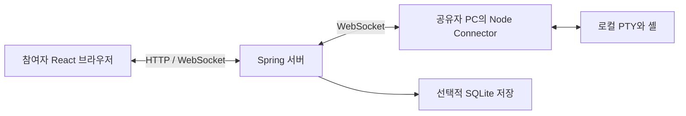

# TTYRoom: 로컬 셸을 함께 사용하는 협업 터미널

TTYRoom은 로컬 셸을 여러 사람이 브라우저로 함께 보고 조작하는 개인 프로젝트다.
React 화면, Spring Boot 서버, 사용자 PC의 Connector와 통신 규약·테스트를 직접 설계하고 개발했다.
셸을 공유하는 사람은 Connector를 실행하고, 참여자는 초대 주소로 입장해 제어권을 얻는다.

## 프로젝트를 짧게 소개한다면

> 여러 사람이 같은 로컬 터미널에서 작업할 수 있는 협업 도구를 만들었습니다.
> 셸은 공유자 PC에서 실행하고, 서버는 방 상태와 입력 제어권을 관리하며 출력을 중계합니다.
> 동시 요청과 연결 단절이 생겨도 확정된 상태를 일관되게 보여주는 데 집중했습니다.
> 저장 실패 시 상태를 노출하지 않는 변경 경계, 수신자별 전달 실패 처리,
> 살아 있는 셸과 보관된 출력의 재접속 복구를 구현하고 오류 주입·실제 PTY·브라우저 테스트로 검증했습니다.

## 구현 범위와 기술 선택

| 구성                          | 직접 구현한 책임                                    | 선택 이유                                                                                                  |
| ----------------------------- | --------------------------------------------------- | ---------------------------------------------------------------------------------------------------------- |
| React · TypeScript            | 협업 창, 터미널 출력, 제어권·연결 상태 UI           | 화면 상태와 서버 메시지 처리의 경계를 나누고 사용자 동작을 컴포넌트와 브라우저 테스트에서 검증한다.        |
| Java 21 · Spring Boot         | 방·세션·입력 정책, 저장 순서, HTTP/WebSocket 어댑터 | 프레임워크의 통신·수명주기 기능을 사용하고 업무 모델의 동시성·실패 계약은 명시적인 타입과 경계로 구현한다. |
| Node.js · node-pty Connector  | 로컬 셸 실행, 출력 보관, 재접속, Kill Switch        | PTY를 공유자 PC에 두어 작업 중인 셸의 수명과 로컬 차단권을 소유하게 한다.                                  |
| SQLite · JDBC                 | 방·터미널의 영속 상태                               | 단일 서버에서 별도 DB 서비스 없이 파일로 상태를 보관한다. 연결·lease·셸 메모리까지 저장하는 것은 아니다.   |
| 단위·프로세스·브라우저 테스트 | 실패 조건, 통신 규약, 실제 협업 흐름                | 오류 주입으로 내부 실패 의미를 확인하고 실제 실행 경계에서 사용자 관찰 결과를 검증한다.                    |



기본 Spring 실행은 loopback 바인딩을 사용하는 로컬 구성이다.
여러 사람이 인터넷에서 사용하는 배포·접근 제어 구성을 완료했다는 뜻은 아니다.
[실행 안내](../README.md)를 먼저 따라갈 수 있다.

## 대표 설계 세 가지를 읽는 순서

각 사례는 문제 → 선택 → 대안·비용 → 코드·테스트 근거 순서로 읽는다.
90초 설명은 면접 연습용 원고이며 실제 발화 시간을 측정한 결과는 아니다.
[계약 대응표](CONTRACTS.md)는 테스트를 찾는 색인이고, 아래는 그 선택을 설명하는 자료다.

## 판단 1: 저장이 끝나기 전에는 변경을 공개하지 않는다

**문제.** 같은 방에서 터미널 생성과 제목 변경이 겹칠 때, 메모리를 먼저 바꾸고
나중에 저장하면 저장 실패를 다른 참여자가 이미 관찰할 수 있다. 생성 ID와 lease까지
되돌리려면 저장 중 도착한 다른 작업의 상태를 덮어쓸 위험도 있다.

**선택.** 방별 명령 순서 안에서 독립 draft를 만들고, durable record가 달라졌을 때만
저장한 뒤 메모리에 commit한다. Spring의 `RoomDirectory.RoomOperation.changeIf`가
이 순서를 소유한다. 저장 중에는 상태 monitor를 놓지만 방별 명령 lock은 유지한다.
따라서 다음 제어 명령은 기다리고, 실시간 경로는 확정된 이전 상태를 사용할 수 있다.
저장 뒤 eligibility를 다시 검사하지 않으므로, 중간에 연결이 끊겨도 시작한 저장 결정을
확정할 수 있다. 후속 효과에서 현재 연결에 전달 가능한지를 판단한다.

**대안·비용.** 메모리 선반영 후 rollback은 live 상태까지 복구하는 복잡성을 만든다.
전체 서버 lock은 관계없는 방을 묶고, DB 트랜잭션만으로는 메모리·소켓까지 원자화되지 않는다.
현재 방식도 같은 방의 제어 명령은 느린 저장을 기다리고 draft 복제 비용을 지불한다.
다른 방의 명령 lock이 독립적이어도 실제 저장 장치의 처리량까지 독립적인 것은 아니다.

**코드·테스트 근거.** [RoomDirectory](../backend/src/main/java/dev/ttyroom/application/RoomDirectory.java)의
`execute`와 `changeIf`, [RoomPersistenceTests](../backend/src/test/java/dev/ttyroom/application/RoomPersistenceTests.java)의
다음 사례를 함께 읽는다.

- `failedReservationDoesNotConsumeIdLeaseOrSendHostCommandAndTheNextCommandRuns`: 저장 실패 뒤 ID·lease·host 명령을 보존하고 다음 명령은 진행한다.
- `pendingSaveKeepsTheCommittedViewWhileRealtimeProceeds`: 저장 gate가 닫혀 있는 동안 확정 상태와 실시간 진행을 관찰한다.
- `queuedRenameCommitsAndPublishesAfterTheEarlierSave`: 앞선 저장 뒤에 후속 제목 변경이 확정·알림된다.
- `anotherRoomCanCommitWhileThisRoomsSaveWaits`: 방별 직렬화 범위를 검사한다. DB 처리량 측정은 아니다.

### 90초 설명

> 협업 터미널에서는 한 요청의 성공보다 여러 참여자가 같은 확정 상태를 보는 것이 중요합니다.
> 예를 들어 터미널 ID를 발급해 화면에 보여준 뒤 저장이 실패하면, 참여자는 존재한다고 본
> 터미널을 다시 잃게 됩니다. 그래서 메모리를 먼저 바꾸고 되돌리는 대신 독립 draft에 변경하고,
> 저장 성공 후에만 실제 상태를 확정하도록 했습니다. 이 순서를 각 기능에 반복하지 않고
> 방의 변경 경계가 소유하도록 했습니다.
>
> Java에서는 명령 순서를 지키는 lock과 상태를 읽고 확정하는 monitor를 나눴습니다.
> 저장을 기다리는 동안 같은 방의 제어 명령은 대기하지만 실시간 경로는 이전 확정 상태를
> 사용할 수 있습니다. 테스트는 저장 gate로 대기를 만들고 상태·알림·ID가 바뀌지 않는지
> 확인합니다.
> 비용은 같은 방의 명령 대기와 draft 복제이며, 분산 서버의 전역 순서나 성능 우위를
> 증명한 설계는 아닙니다.

**후속 질문과 답변 포인트**

- **왜 `@Transactional`로 끝내지 않았나?** DB 저장, 메모리 확정, 소켓 수락은 서로 다른 자원이다. 현재 경계는 순서를 보장하며 세 자원의 원자성을 주장하지 않는다.
- **모든 이벤트가 같은 큐를 지나나?** 입장·제어·만료는 명령 순서를 공유한다. binary 입력·출력·cursor·단절 처리는 짧은 상태 monitor를 사용한다. 논리적 분리가 동일 소켓의 지연까지 제거하지는 않는다.
- **여러 서버가 같은 방을 처리한다면?** 프로세스 lock으로 부족하다. 방 소유권과 라우팅, 동시 갱신 충돌 정책을 먼저 정해야 한다.

## 판단 2: 저장 성공과 전달 성공을 구분한다

**문제.** 제목 변경을 저장한 뒤 첫 수신자의 연결이 끊겼다고 저장을 다시 실행하거나
되돌리면, 이미 확정한 상태와 다른 참여자가 관찰한 결과가 어긋난다.

**선택.** `ChangeResult`로 Reply/Broadcast/HostRequest 등의 결과를 표현하고 commit 후
효과를 처리한다. Spring의 `broadcast`는 수신자별 `PeerUnavailable`을 처리해 해당
연결을 정리하고 다음 수신자로 진행한다. 예상 밖 구현 예외는 전파하며, 이때 나머지
수신자까지 알림을 완료한다는 보장은 없다. 어느 쪽도 저장을 되돌리거나 반복하지 않는다.
`SocketSender`의 성공은 비동기 송신 큐 수락이며 실제 클라이언트 수신 확인이 아니다.

**대안·비용.** 전송 실패까지 저장 실패로 취급하면 재실행 부작용이 생긴다. 반대로 모든
예외를 무시하면 구현 오류를 숨긴다. 현재는 예상된 연결 실패만 격리하지만 프로세스가
commit과 전송 사이에 종료되면 알림이 유실될 수 있다. 지속적 전달이 필요해지면 outbox와
소비자 중복 처리 등을 검토해야 하며, 저장·재시도·정리 비용도 추가된다. 현재 구현은 outbox가 아니다.

**코드·테스트 근거.** [RoomSessions](../backend/src/main/java/dev/ttyroom/application/RoomSessions.java)의
`publish`·`broadcast`, [SocketSender](../backend/src/main/java/dev/ttyroom/adapter/ws/SocketSender.java),
[RoomPersistenceTests](../backend/src/test/java/dev/ttyroom/application/RoomPersistenceTests.java)의
두 테스트가 저장 상태·메모리 상태·저장 횟수와 수신자 관찰을 연결한다.

- `unavailableRecipientDoesNotUndoCommittedRenameOrBlockOtherRecipients`: 실패한 수신자만 정리하고 정상 수신자가 한 번 알림을 받는다.
- `unexpectedDeliveryFailurePropagatesWithoutUndoingOrRepeatingCommittedRename`: 같은 예외가 전파되어도 저장과 commit은 유지되고 저장을 반복하지 않는다.

두 테스트는 기존 구현에서 바로 통과한 **특성 테스트**다.
[추가 당시 기록](WORK_LOG.md#자원-수명과-실패-처리)을 RED → GREEN 오류 수정으로 바꾸어 설명하지 않는다.

### 90초 설명

> 제목 변경의 저장이 성공했는데 첫 참여자의 연결이 끊기는 경우를 따로 다뤘습니다.
> 이 실패를 요청 전체의 실패로 보고 저장을 재시도하면 이미 확정된 결정을 다시 실행할 수
> 있습니다. 그래서 저장 성공과 전달 성공을 분리했습니다. 업무 변경은 결과 값을 반환하고,
> 메모리에 commit한 뒤 세션 계층이 알림을 보냅니다.
>
> 예상된 연결 불가는 해당 수신자만 정리하고 다음 수신자로 진행합니다. 반면 구현 오류까지
> 연결 장애로 숨기지는 않습니다. 테스트에서는 송신 실패를 주입한 뒤 저장된 제목과 메모리
> 제목이 같고, 저장이 한 번만 추가되며, 정상 참여자가 알림을 받는지 확인합니다.
> 이 테스트는 이미 있던 동작을 고정한 특성 테스트였습니다.
> 또 송신 큐 수락은 실제 수신 확인이 아닙니다. commit 직후 프로세스가 죽는 구간까지
> 보장하려면 지속적 전달 장치가 필요하지만, 지금은 그런 요구와 비용을 추가하지 않았습니다.

**후속 질문과 답변 포인트**

- **응답을 못 받았으니 같은 요청을 재시도해도 되나?** 전송 실패만으로 미확정을 단정할 수 없다. 명령별 멱등성·조회·재조정 정책이 필요하며 입력 명령 자동 재실행은 하지 않는다.
- **왜 이벤트 버스를 추가하지 않았나?** 현재 결과의 소비와 순서는 세션 계층에서 설명 가능하다. 중간 버스가 전달 보장을 자동으로 만들지는 않는다.
- **새 연결을 이전 연결의 실패가 닫지 않나?** `disconnected`가 현재 Member와 동일한 객체인지 검사한다. 별도의 연결 교체·만료 테스트로 확인한다.

## 판단 3: 재접속은 셸 재실행이 아니라 상태 대조와 출력 복구다

**문제.** 네트워크 단절은 셸 종료와 다르다. Connector의 PTY가 살아 있는데 새 셸을 만들면
작업 맥락을 잃고, 출력 재전송을 그대로 붙이면 같은 내용이 두 번 보일 수 있다.
반대로 서버 재시작 후 메모리 출력을 모두 복원했다고 가정하면 보관하지 않은 내용을 약속하게 된다.

**선택.** Connector는 실제 PTY와 제한된 출력 버퍼를 소유하고 재접속 때 terminalId·runtimeId의
inventory를 보낸다. 서버는 저장된 workspace와 실제 runtime을 대조한 뒤 replay 위치를 알린다.
Connector source 순번은 중복·역순 제거에, 서버가 부여하는 browser 순번은 화면 출력의 순서에 쓴다.
서버 재시작은 출력 메모리를 초기화하므로 브라우저도 welcome을 기준으로 투영 상태를 다시 만든다.
클라이언트가 받은 `sync`는 서버가 선언한 출력 경계이며 PTY 입력 실행의 확인이 아니다.

**대안·비용.** 재접속마다 셸을 다시 만들면 간단하지만 진행 중인 작업을 잃는다. 모든 출력을
영구 보관하면 복구 범위는 늘릴 수 있으나 저장 비용과 터미널 민감 정보의 보관 문제가 추가된다.
현재는 bounded replay를 선택해 버퍼 밖 출력과 종료한 Connector의 셸 메모리는 복원하지 못한다.
서버 재시작 후 lease·presence도 영속 상태처럼 복원하지 않는다. 브라우저만 유예 내에 재접속할 때의
lease 유지와 서버 프로세스 재시작은 다른 계약이다.

**코드·테스트 근거.** [ConnectorApp](../connector/src/connector-app.ts)이 inventory와 replay를,
[TerminalOutput](../backend/src/main/java/dev/ttyroom/application/TerminalOutput.java)이 source 중복 제거와
browser 순번·보관 한도를 소유한다. [TerminalWorkspace](../backend/src/main/java/dev/ttyroom/domain/TerminalWorkspace.java)가
runtime의 소유권·충돌·누락을 대조한다.

- [terminal-recovery E2E](../e2e/src/terminal-recovery.e2e.ts): source 중복·역순 제거, runtime 충돌 거절, late join과 resync의 출력 순서를 검사한다. wire peer를 사용하는 계약 테스트다.
- [persistence E2E](../e2e/src/persistence.e2e.ts): 새 PID에서 workspace를 복원하고 lease·presence·출력은 초기화한다. 저장 오류 주입과 구별한다.
- [resilience E2E](../e2e/src/resilience.e2e.ts): 실제 Connector·PTY를 유지한 서버 재시작과 단절 중 출력 복구를 검사한다.
- [브라우저 recovery](../web/e2e/room-recovery.e2e.ts): 실제 화면의 한 번 출력, gap 복구, 영속 서버 재시작 후 같은 PTY를 확인한다.

### 90초 설명

> 재접속을 새 셸 실행으로 처리하면 사용자가 하던 작업이 사라집니다. 이 프로젝트에서는
> 셸의 소유자를 사용자 PC의 Connector로 두고, 서버 연결이 끊겨도 PTY가 살아 있는 경우를
> 복구 대상으로 삼았습니다. 다시 연결되면 Connector가 terminalId와 runtimeId 목록을 보내고,
> 서버가 자신의 workspace와 대조해 같은 실행인지 확인한 뒤 보관된 출력을 요청합니다.
>
> 출력에는 두 순번이 있습니다. Connector 순번으로 재전송 중복을 제거하고, 서버 순번으로
> 브라우저에 보이는 순서를 관리합니다. 서버가 재시작하면 출력 메모리와 lease는 초기화되고,
> 살아 있는 Connector의 제한된 버퍼에서 다시 복구합니다. 테스트도 프로토콜 순번 검사와
> 실제 PTY·브라우저 복구를 나눴습니다. 화면에 한 번 출력된다는 검증을 입력 exactly-once로
> 확대하지 않으며, Connector 종료 후 셸 메모리나 버퍼 밖 출력까지 복원한다고 설명하지 않습니다.

**후속 질문과 답변 포인트**

- **같은 clientId로 돌아오면 인증된 같은 사람인가?** 현재 v7은 방 토큰과 클라이언트가 제시한 식별자를 사용한다. 연결 교체 보호는 신원 인증이 아니며 주체별 credential 입장은 후속 백로그다.
- **입력도 순번이 있으니 재전송하면 되나?** PTY가 실행했는지 모르는 단절 구간에서 재실행하면 부작용이 중복될 수 있다. 현재 입력 exactly-once 계약은 없다.
- **89초 시연이 서버 재시작도 증명하나?** [영상](demo/README.md)은 브라우저 연결 복구를 보여준다. 서버 재시작은 위 자동화 테스트와 아래 수동 발표 절차의 별도 범위다.

수명주기와 중복 상태의 소유권을 더 묻는다면 [운영 코드 경계 검토](WORK_LOG.md#자원-수명과-실패-처리)를
참고한다. replay 순번 일원화와 필요한 geometry 상태를 유지한 이유를 함께 설명한다.

## 테스트로 설명할 수 있는 실제 사례

| 사례                | 실패 또는 변경 전 상태                                                         | 수정과 확인                                               | 작업 성격                |
| ------------------- | ------------------------------------------------------------------------------ | --------------------------------------------------------- | ------------------------ |
| Connector 생성 보고 | 생성 완료 보고의 동기 예외를 spawn 실패로 처리해 살아 있는 PTY를 closed로 보고 | 전송 예외를 주입한 테스트 실패 후 catch를 PTY 생성에 한정 | RED → GREEN 오류 수정    |
| 종료 후 join        | dispose한 런타임이 새 세션을 생성해 기존 종료 경로로 정리되지 않음             | 호출 순서로 재현 후 disposed 검사 추가                    | RED → GREEN 오류 수정    |
| 출력 순번 중복      | 앱과 replay buffer가 같은 순번을 별도로 관리                                   | 용량 초과 후 순번 지속 계약을 먼저 고정하고 중복 Map 제거 | GREEN → REFACTOR → GREEN |
| 저장 후 알림 실패   | 의도한 동작은 이미 구현되어 있으나 직접 검증 부족                              | 저장·메모리 상태·저장 횟수·다른 수신자의 관찰을 검사      | 특성 테스트 보강         |

[Connector 실패 기록](WORK_LOG.md#자원-수명과-실패-처리)과
[런타임 종료 기록](WORK_LOG.md#자원-수명과-실패-처리)에 실패 확인과 수정 범위를 남겼다.
두 오류는 테스트로 재현한 것이며 실제 운영 장애 사례로 표현하지 않는다.

테스트는 준비·행동·관찰·검증을 구분한다. fixture는 자원 수명과 준비 완료를 책임지고,
기대 결과는 테스트 본문에서 읽을 수 있게 둔다. 이전 테스트의 상태에 의존하지 않는다.
실제 셸 검증은 입력 echo를 성공으로 오인하지 않도록 명령 원문에 없는 실행 결과를 관찰한다.
[작성 가이드와 예시](CODE_STYLE.md)를 함께 읽는다.

## 검증 수준과 남은 한계

[보안 모델](SECURITY_MODEL.md)은 토큰·역할·셸 실행의 신뢰 경계를 설명한다.
clientId 기반 재접속 보호는 사용자 신원 인증과 다르며, 현재의 View only는 읽기 전용 ACL이 아니다.

2026-09-28 로컬 검증 기록은 Java 355개, TypeScript 단위 544개,
Chromium 브라우저 E2E Node/Spring 각각 38개다. 서로 다른 단계의 실행 결과이며
한 번에 모두 실행한 단일 CI 결과가 아니다. 숫자는 검증 범위를 찾는 보조 정보이지 품질 점수가 아니다.

브라우저 결과는 [검증 범위와 로컬 기록 안내](VERIFICATION.md),
Java 결과는 [저장 후 알림 검토](WORK_LOG.md#자원-수명과-실패-처리)에 연결되어 있다.
이후 공개 CI의 소스 `ae395b2`에서 6개 job 성공을 확인했다. 실행 링크와 환경·집계 범위는
[공개 CI 기록](VERIFICATION.md)에 있다. 위 로컬 수치와 합산하지 않으며, CI 성공을 배포·운영 성공으로 표현하지 않는다.

| 확인한 범위                                     | 아직 주장하지 않는 보장                                   |
| ----------------------------------------------- | --------------------------------------------------------- |
| 단일 서버 프로세스 안의 방별 직렬화·lease       | 다중 서버의 분산 lease·전역 순서                          |
| bounded output replay와 중복 출력 처리          | 입력 명령 exactly-once 실행·무한 출력 보존                |
| SQLite 상태 복원과 살아 있는 Connector의 재접속 | 임의 장애에서도 상태·메시지를 함께 확정하는 분산 트랜잭션 |
| Chromium의 협업·복구 시나리오                   | Safari·모바일·실사용 규모의 성능·보안 검증                |

구조화된 운영 진단과 실사용 규모의 부하·장시간 실행 검증은 후속 과제다.
검증 환경과 조건을 고정한 뒤 처리량·지연시간·메모리 사용을 측정한다.

## 5분 시연 순서

아래 시간은 발표 구성안이며 측정한 실행 시간이 아니다. 설치·빌드는 발표 전에 끝낸다.
현재 UI·CLI와 자동화된 복구 시나리오를 기준으로 작성했으며, 이 수동 순서 전체를
이번 문서 작업에서 새로 실행한 것은 아니다.

### 발표 전 준비

Java 21의 JAVA_HOME을 설정하고 [빠른 시작](../README.md)의 의존성 설치를 마친다.
저장소 루트에서 다음을 실행한다.

```sh
./scripts/build-spring.sh
# 터미널 A: 발표용 저장 경로를 사용한다.
TTYROOM_STATE_PATH=.ttyroom/portfolio-demo.sqlite ./scripts/run-spring.sh
```

브라우저에서 `http://127.0.0.1:3000`을 열어 새 방을 만든다. 두 번째 참여자는
별도 브라우저 프로필 또는 시크릿 창으로 같은 초대 주소에 입장시켜 Alice/Bob으로 구분한다.
방 생성 탭의 Add Host에서 Host credential을 발급한다. 다음 명령에는 fragment 없는 방 주소를 넣고
Host credential은 Connector의 숨김 프롬프트에 붙여 넣는다.

```sh
# 터미널 B: 이 프로세스가 로컬 셸을 소유하므로 복구 시연 중 계속 켜 둔다.
node connector/dist/index.js join "http://127.0.0.1:3000/r/ROOM_ID" --name "Demo computer"
```

### 화면에서 보여줄 행동과 설명

| 시간 배분 | 행동                                                | 관찰할 결과                                           | 설명할 설계                             |
| --------- | --------------------------------------------------- | ----------------------------------------------------- | --------------------------------------- |
| 0:00–0:40 | 두 참여자 화면과 Connector를 보여주고 터미널을 연다 | 같은 터미널이 두 화면에 나타난다                      | 브라우저·서버·사용자 PC의 책임 구분     |
| 0:40–1:30 | Alice가 제어권을 얻어 아래 출력 명령을 실행한다     | 두 화면에 실행 결과가 보이고 Bob은 View only다        | 관찰과 입력 권한은 별개                 |
| 1:30–2:10 | 창을 이동하고 Alice 화면을 새로고침한다             | 공유 위치와 참여자 상태가 복원된다                    | 공유 상태와 로컬 화면 상태의 구분       |
| 2:10–3:30 | 아래 절차로 서버만 종료·재시작한다                  | 재접속 후 같은 셸의 변수를 다시 읽을 수 있다          | 서버 저장 상태와 살아 있는 PTY를 재조정 |
| 3:30–4:10 | Connector 터미널 B에서 k를 눌렀다가 다시 누른다     | 원격 입력 차단과 해제가 화면에 반영된다               | 셸 소유자의 로컬 차단권                 |
| 4:10–5:00 | 저장 경계 코드와 실패 테스트를 연다                 | save → commit → 효과 순서와 오류 주입 사례를 설명한다 | 정상 경로뿐 아니라 실패 의미를 검증     |

첫 출력은 브라우저 안의 셸에서 실행한다. 합쳐진 결과 `demo-ready`가 명령 원문에 없어
입력 echo와 셸 실행 결과를 구분할 수 있다.

```sh
printf '%s%s\n' 'demo-' 'ready'
```

### 서버 재시작 시연

1. Alice가 제어권을 가진 브라우저 셸에서 다음을 실행한다.

   ```sh
   export TTYROOM_DEMO_SENTINEL=demo-'survived'
   printf '%s%s\n' 'restart-' 'armed'
   ```

2. `restart-armed` 출력이 보이면 **서버 터미널 A**에서 Ctrl+C를 누른다.
   Connector 터미널 B는 유지한다. 서버 프로세스가 종료된 뒤 같은 포트·같은 SQLite 경로로 다시 실행한다.

   ```sh
   TTYROOM_STATE_PATH=.ttyroom/portfolio-demo.sqlite ./scripts/run-spring.sh
   ```

3. 브라우저의 재접속이 끝나고 터미널이 Available이 되면 제어권을 다시 얻는다.
   서버 재시작 전의 lease가 그대로 저장·복원된다고 설명하지 않는다.

   ```sh
   printf '%s\n' "$TTYROOM_DEMO_SENTINEL"
   ```

4. `demo-survived`가 나오면 살아 있던 셸의 환경을 확인한 것이다.
   셸 메모리를 SQLite에서 복원한 것이 아니다. 이전 화면 출력 전체가 영구 저장된다는 뜻도 아니다.

시연 종료는 Connector 터미널 B와 서버 터미널 A에서 각각 Ctrl+C로 처리한다.
발표용 SQLite 파일은 남는다. 기존 파일을 지우는 명령은 시연 절차에 포함하지 않는다.

### 시연이 어긋날 때 확인할 것

- **Room Gone:** 같은 SQLite 경로로 서버를 다시 실행했는지 확인한다.
- **셸 변수가 비어 있음:** Connector까지 종료했거나 다른 터미널을 열었는지 확인한다.
- **입력 불가:** 제어권 재획득, exclusive/shared 상태, Kill Switch를 확인한다.
- **화면이 뜨지 않음:** API-only JAR로 덮어쓰지 않았는지 확인하고 웹 포함 빌드를 다시 한다.

예상대로 동작하지 않으면 성공했다고 설명하지 않고 관찰한 상태를 말한다.
발표 전 자동 검증은 다음 명령으로 실행할 수 있다. 수동 시연과 별도의 서버·방을 사용한다.

```sh
SHELL=/bin/zsh ./scripts/test-spring.sh browser e2e/room-recovery.e2e.ts
```

시연과 대응하는 [복구 E2E](../web/e2e/room-recovery.e2e.ts),
[입력·제어권 E2E](../web/e2e/room-control.e2e.ts),
[기존 브라우저 실행 로그](VERIFICATION.md)를 함께 준비한다.

## 면접에서 이어질 질문

- **왜 셸을 서버에서 실행하지 않았는가?** 공유자 PC의 작업 환경과 실행 중인 셸을 함께 사용하는 제품이다.
  Connector가 PTY 수명과 로컬 차단권을 소유한다. 이 선택은 샌드박스나 원격 접근 보안을 대신하지 않는다.
- **왜 큰 RoomSessions를 더 쪼개지 않았는가?** 인증된 연결의 동일성·수명·효과 순서가
  공유하는 지식을 유지했다. 독립적인 변경 이유와 호출 부담 감소가 확인될 때 분리한다.
- **왜 `@Transactional`만으로 해결하지 않았는가?** DB 저장뿐 아니라 메모리 상태 확정과
  WebSocket 후속 효과의 순서를 다룬다. DB 트랜잭션만으로 이 전체 경계가 원자적이 되지 않는다.
- **다중 서버로 확장한다면?** 방 소유권·라우팅·lease·지속적 이벤트 전달 요구를 먼저 정의해야 한다.
  현재의 프로세스 내부 잠금을 그대로 확장 가능한 구조라고 주장하지 않는다.
- **테스트가 구현을 따라가는 것은 아닌가?** 저장소 gate나 전송 오류는 조건을 만들기 위해 사용하고,
  검증은 확정 상태·수신 결과·자원 정리처럼 외부 계약에 둔다. 공통 E2E는 서버 내부를 import하지 않는다.
