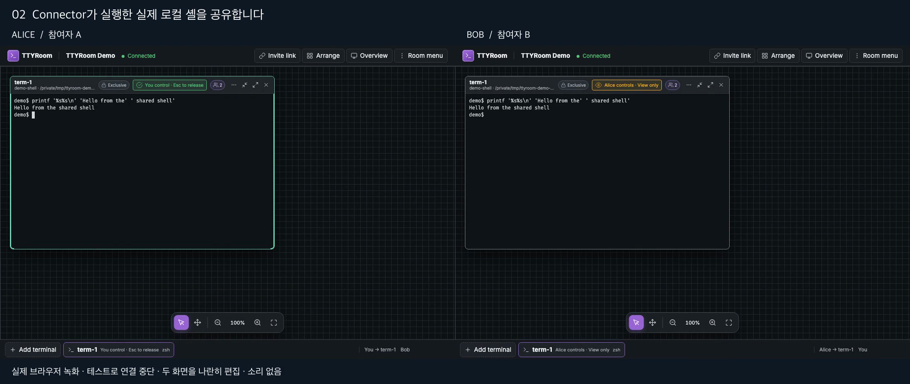

# 실제 협업 시연

[](ttyroom-demo.mp4)

89.44초 · 2200×930 · H.264 MP4 · 약 2.6 MB · 무음

[시연 영상](ttyroom-demo.mp4)은 Spring 서버, 실제 Node Connector·PTY·zsh,
서로 독립된 Chromium context 두 개로 녹화한다. 두 화면을 나란히 배치하고 설명 자막을 더한다.
터미널 출력이나 앱 상태를 합성하지 않는다. 무음 영상이다.

## 장면

1. Alice와 Bob이 같은 방에 입장한다.
2. Alice가 실제 로컬 셸을 열고 출력이 두 브라우저에 전달되는 것을 확인한다.
3. Alice가 제어권을 놓고 Bob이 제어권을 얻어 입력한다.
4. 테스트 장치가 Alice의 WebSocket 양쪽 연결을 끊는다. Bob은 계속 출력한다.
5. Alice가 재접속해 끊긴 동안의 출력을 받는다. 참가자 식별자 유지와 해당 출력의 한 번 표시를 검사한다.

이 시연의 복구는 살아 있는 서버·Connector에서 브라우저 연결을 다시 맺는 경우다.
인터넷 장애 전체, 서버 재시작 복구, 입력 exactly-once 보장, 공개 배포를 입증하지 않는다.
프로토콜 v7의 신뢰 가정은 [보안 모델](../SECURITY_MODEL.md)을 따른다.

## 재현

Java 21, Node 22 이상, pnpm 10.10.0, Python 3, `/bin/zsh`, Chromium, ffmpeg와 한글 폰트가 필요하다.
저장소 루트에서 실행한다.

```sh
pnpm install --frozen-lockfile
pnpm --filter @ttyroom/web exec playwright install chromium
./scripts/build-spring.sh
./scripts/test-spring.sh browser --config playwright.demo.config.ts
python3 scripts/demo/render.py --font /System/Library/Fonts/AppleSDGothicNeo.ttc
```

마지막 명령의 폰트 경로는 macOS 예시다. 다른 환경에서는 실제 설치한 한글 폰트 파일을 지정한다.
녹화는 약 2분 소요한다. 화면을 읽을 시간을 위한 지연을 명시적으로 넣었으며 준비 완료는
별도의 UI·출력 조건으로 확인한다. 일반 회귀 테스트 38개에는 이 녹화 시나리오를 포함하지 않는다.

Connector는 임시 작업 디렉터리와 전용 HOME·zsh 설정을 사용하고 환경 변수를 허용 목록으로 전달한다.
초대 주소는 브라우저 주소창을 포함하지 않는 content 녹화에 표시되지 않는다. 종료 시 임시 방·셸을 정리한다.
최종 화면의 실제 토큰·개인 저장소 경로 노출을 검사하고, 공개 전 영상 전체를 다시 확인한다.

원본 두 WebM, 장면 시각, 소스 SHA, 실행 결과는 로컬 `artifacts/demo/`에 남긴다.
최종 MP4와 포스터만 공개 저장소에 포함한다. 각 브라우저의 독립 녹화를 시작점 기준으로 맞춘 편집으로,
프레임 단위 네트워크 지연을 측정하는 자료가 아니다.

## 이번 녹화의 검증

- 런타임 소스는 `ae395b2`이며 별도 녹화 코드와 시연 설정을 이 문서와 함께 추가했다.
- 최초 1000px viewport는 앱의 데스크톱 입력 제한에 걸렸다. 1100×760으로 수정한 뒤 녹화 시나리오 1개가 통과했다. 이는 기능 결함의 TDD 수정이 아닌 녹화 환경 수정이다.
- 전체 MP4 디코딩 검사와 Chromium의 끝까지 재생을 확인하고, 입장·제어권 전환·연결 중단·복구를 포함한 9개 시점의 화면을 직접 확인했다.
- 준비·입력·관찰은 기존 E2E의 RoomPage와 실제 프로세스 실행 경계를 재사용했다. 성공하지 않은 녹화는 manifest 상태로 렌더를 차단한다.
- 독립 코드 리뷰에서 발견한 실패 시 정리 누락과 이전 녹화 재사용 위험을 보완했다. 실패한 첫 시도의 로그도 로컬에 보존했다.
- 웹 타입 검사·의존성 경계 검사 통과. 제품 런타임 코드와 일반 브라우저 회귀 테스트는 변경하지 않았다.
