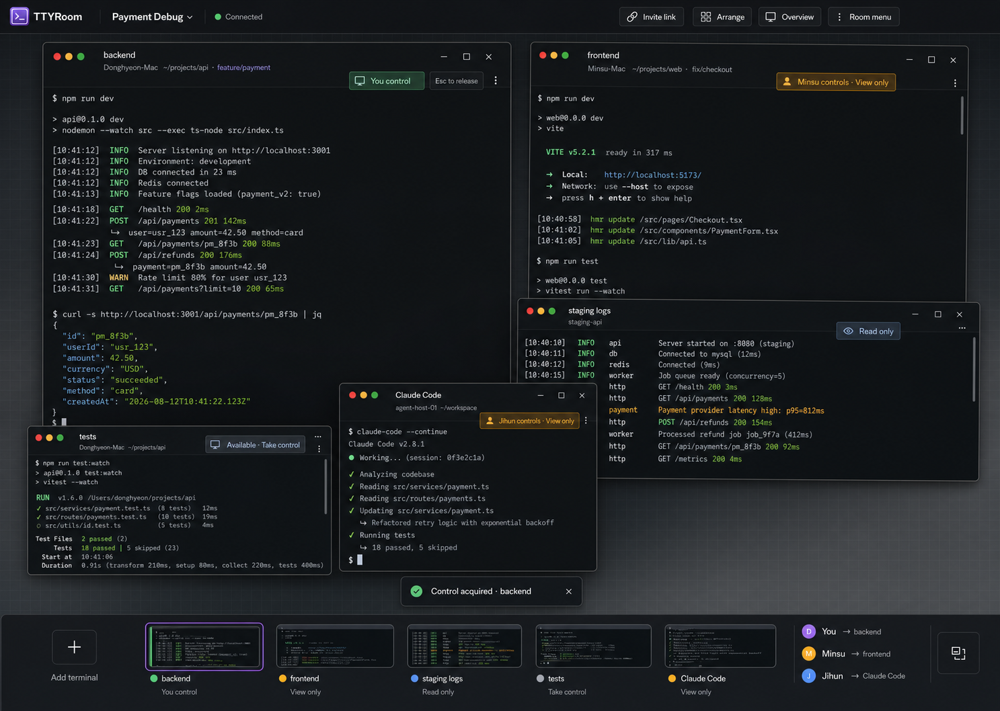

# TTYRoom Web UI 화면 설계

> **상태:** MVP Web 트랙 화면 설계 기준  
> **기반 문서:** `2026-08-12-ttyroom-mvp-design.md`, `2026-08-12-ttyroom-mvp.md`  
> **대상:** 데스크톱 브라우저, React + Vite + xterm.js

## 1. 제품 화면의 핵심

TTYRoom의 Web UI는 터미널을 탭 안에 숨기는 IDE가 아니라, 여러 Host와 에이전트의
터미널을 한 브라우저에서 동시에 관찰하고 필요한 창에 직접 개입하는 **터미널 전용
데스크톱**이다.

사용자는 Room에 들어온 직후 다음을 이해할 수 있어야 한다.

1. 어떤 Host와 Terminal이 연결되어 있는가.
2. 각 Terminal에서 지금 어떤 작업이 진행 중인가.
3. 누가 어느 Terminal을 조작하고 있는가.
4. 내가 클릭하면 창만 선택되는지, 입력권까지 바뀌는지.
5. 연결이 끊겨도 로컬 프로세스가 계속 실행되는지.

## 2. 기준 화면



화면은 `Payment Debug` Quick Room에 다섯 개 Terminal이 열린 상태를 보여준다.

- `backend`: 내가 입력권을 가진 전면 창
- `frontend`: 민수가 입력권을 가진 관찰 가능한 창
- `staging logs`: 원격 입력이 차단된 Read-only 창
- `tests`: 입력권을 획득할 수 있는 Available 창
- `Claude Code`: 지훈이 조작 중인 에이전트 Terminal

창은 자유롭게 이동·크기 조절·겹치기가 가능하다. 겹친 창도 제목, Host, 입력권 상태가
보이도록 초기 배치하며, 사용자가 `Arrange` 또는 `Overview`로 언제든 전체 상태를 다시
파악할 수 있게 한다.

## 3. 화면 구조

### 3.1 Top Bar

Top Bar는 Room 전체에 적용되는 정보와 동작만 가진다.

| 요소 | 목적 |
|---|---|
| TTYRoom | 제품 식별 및 Room 목록 또는 시작 화면 진입점 |
| `Payment Debug` | 현재 Quick Room 식별 |
| `Connected` | 브라우저와 서버 연결 상태 |
| `Invite link` | 현재 Room 초대 링크 복사 |
| `Arrange` | 모든 Terminal 창을 겹치지 않게 자동 정렬 |
| `Overview` | 모든 창을 축소해 한 화면에서 선택 |
| Room menu | Room 종료 및 제한적인 Room 동작 |

Top Bar에는 Terminal 생성, 입력권, 창별 오류처럼 특정 Terminal에 속한 동작을 두지
않는다.

### 3.2 Desktop Workspace

Workspace는 Terminal 창이 놓이는 전체 화면 작업면이다.

- 기본 배경은 저대비 grid를 사용해 창의 이동과 크기를 인지할 수 있게 한다.
- 새 Terminal은 기존 창을 완전히 덮지 않는 cascade 위치에 생성한다.
- 창의 일부가 화면 밖으로 완전히 사라지지 않도록 title bar 최소 노출 영역을 보장한다.
- 창을 선택하면 z-order 최상단으로 올리지만 입력권은 바꾸지 않는다.
- 창이 많아져도 Terminal 출력을 축소 렌더링하지 않는다. 공간이 부족하면 겹치기,
  최소화, Overview로 해결한다.

### 3.3 Terminal Window

각 Terminal Window는 다음 정보를 가진다.

```text
backend
Donghyeon-Mac · ~/projects/api · feature/payment
You control · Esc to release
```

Title Bar:

- Terminal 이름
- Host 이름
- 현재 작업 디렉터리
- Git branch
- 입력권 상태
- 최소화, 최대화, 닫기, 추가 메뉴

Body:

- xterm.js Terminal 출력과 입력
- 현재 입력 가능 여부에 맞는 cursor 및 focus 표현
- 스크롤이 live tail에서 벗어나면 `Live output paused` 표시

Footer는 기본적으로 두지 않는다. 입력권 상태와 핵심 동작은 출력 영역을 침범하지 않도록
Title Bar에 모은다.

### 3.4 Dock

Dock은 열린 Terminal 전체와 참여자의 현재 위치를 빠르게 복구하는 도구다.

- Terminal별 이름, 상태, activity 표시
- 최소화된 Terminal 복원
- 현재 전면 창 강조
- `Add terminal` 진입점
- `동현 → backend`, `민수 → frontend` 형태의 participant presence

시안에는 축소 preview가 있지만, MVP 구현은 동일한 Terminal을 두 번 렌더링하지 않는다.
Dock item은 이름, 상태, 최근 activity만으로 시작하고 실제 thumbnail은 후속 최적화로 둔다.

## 4. Window Manager 동작

### 4.1 기본 동작

| 행동 | 결과 |
|---|---|
| Title Bar 클릭 | 창을 전면으로 이동. 입력권은 변경하지 않음 |
| Title Bar 드래그 | 창 이동 |
| 모서리 또는 가장자리 드래그 | 창 크기 조절 및 xterm.js fit |
| 최소화 | Dock으로 이동. PTY와 출력 수신은 유지 |
| 최대화 | Workspace 전체 사용. 다른 창은 Dock에서 유지 |
| 닫기 | Terminal 종료 확인 후 Agent에 close 요청 |
| 화면 가장자리로 드래그 | 좌우 또는 4분할 snap preview 표시 |
| `Arrange` | 열린 창을 현재 viewport에 자동 tile |
| `Overview` | 모든 창의 위치를 유지한 채 축소 overview 진입 |

### 4.2 세 가지 Layout 상태

- **Floating:** 기본값. 자유 이동, 크기 조절, 겹치기 허용.
- **Arranged:** 현재 viewport에서 모든 열린 창을 자동 grid로 정렬.
- **Focused:** 한 창을 최대화하고 나머지는 Dock으로 접근.

이들은 별개의 화면이나 서버 상태가 아니다. 동일한 Terminal Window들의 사용자별 표현
상태다.

### 4.3 배치 상태의 소유권

서버와 브라우저의 책임을 다음처럼 나눈다.

| 서버 authoritative | 브라우저 사용자별 상태 |
|---|---|
| Host 및 Terminal 목록 | 창 위치와 크기 |
| Terminal open/exited 상태 | z-order |
| Participant 상태 | 최소화·최대화·snap 상태 |
| Lease와 입력권 소유자 | Floating·Arranged·Focused 선택 |
| Terminal 출력 seq와 scrollback | 마지막 viewport별 레이아웃 |

한 사용자가 창을 이동해도 다른 참여자의 화면은 움직이지 않는다. 브라우저 배치는
`roomId + clientId` 기준 localStorage에 저장하고, Room이 사라지거나 Terminal이 제거되면
해당 항목을 정리한다. 공유 레이아웃은 MVP 범위에 포함하지 않는다.

## 5. 입력권 UX

### 5.1 창 선택과 입력권 분리

Floating Window에서는 관찰을 위해 창을 자주 앞으로 가져오므로, 기존 MVP 설계의
`빈 Terminal 클릭 즉시 입력권 획득`을 그대로 적용하면 의도하지 않은 Lease 전환이
발생하기 쉽다.

Web UI는 다음 계약을 사용한다.

| 상태 | 표시 | 창 또는 Body 클릭 | 명시적 동작 |
|---|---|---|---|
| 내가 조작 중 | `You control` | 전면 이동 및 입력 focus | `Esc to release` |
| 비어 있음 | `Available` | 전면 이동 및 관찰 focus | `Take control` |
| 타인 조작 중 | `Minsu controls · View only` | 전면 이동, 스크롤 가능 | MVP에서는 takeover 없음 |
| 원격 입력 차단 | `Read only` | 전면 이동, 스크롤 가능 | 입력 동작 없음 |

상태는 색상만으로 표현하지 않는다. icon, 사용자 이름, 동사를 함께 사용한다.

### 5.2 입력권 전환

사용자가 이미 `backend`를 조작하면서 Available 상태의 `tests`에서 `Take control`을
누르면 다음 순서로 동작한다.

1. 버튼 문구를 `Switch control`로 표시해 기존 Lease가 해제됨을 사전에 알린다.
2. 서버에 기존 Lease 해제와 새 Lease 획득을 요청한다.
3. 성공한 경우 `Control acquired · tests`를 짧게 표시한다.
4. 실패한 경우 `Minsu now controls tests`처럼 현재 소유자를 알려 주고 View-only 상태를
   유지한다.

프로세스 실행 상태는 Lease 해제와 무관하다. 입력권이 바뀌어도 기존 명령과 PTY는 계속
실행된다.

## 6. Screen 및 Overlay 목록

### 6.1 Room Entry

초대 링크 진입 시 작은 entry sheet를 표시한다.

- Room 이름
- 닉네임 입력
- `Join room`
- Quick Room의 임시성에 대한 한 줄 안내

계정 생성과 조직 설정은 요구하지 않는다.

### 6.2 Room Workspace

이 문서의 기준 이미지에 해당하는 메인 화면이다. 여러 Terminal을 Floating Window로
동시에 관찰하고 조작한다.

### 6.3 Add Host Drawer

`Add host` 동작은 다음 상태를 한 drawer에서 이어서 보여준다.

```text
npx ttyroom join <url>
[Copy command]

Waiting for Agent…
Donghyeon-Mac connected
```

명령 복사, 연결 대기, 성공 또는 실패를 같은 맥락에서 처리한다. Ctrl+C가 Host Agent와
PTY를 종료한다는 사실을 짧게 안내한다.

### 6.4 Overview

모든 창을 축소하고 겹치지 않게 나열한다.

- Terminal 이름과 Host
- 입력권 상태
- 마지막 activity
- 선택 시 기존 위치를 유지한 채 해당 창을 전면으로 복귀

Overview에서는 Terminal 입력을 허용하지 않는다.

### 6.5 Room Gone

서버 재시작 등으로 Quick Room이 소멸한 경우에만 Workspace 전체를 교체한다.

- `This Quick Room no longer exists`
- 새 Room을 만드는 동작
- 실행 중이던 로컬 PTY가 Agent 종료 여부에 따라 달라질 수 있다는 안내

## 7. 연결·오류 상태

오류는 가능한 한 영향을 받는 대상에 붙인다.

| 상황 | 화면 처리 |
|---|---|
| 브라우저 재연결 | Workspace 유지, 상단에 `Reconnecting… Processes keep running` |
| snapshot 복구 | `Restoring terminals and output…` 후 `Live` |
| Host 일시 단절 | 해당 Host의 모든 창에 `Host offline` 표시, 입력 차단 |
| 셸 종료 | 창에 `Exited (code)` 표시, 닫기와 새 Terminal 제공 |
| Lease 거절 | 요청한 사용자에게만 현재 소유자를 포함한 toast |
| protocol 불일치 | 현재 클라이언트 또는 Agent 업데이트 안내 |
| Room 소멸 | `Room Gone` 전체 화면 |

재연결 중에는 창 위치를 초기화하지 않는다. 같은 `clientId`가 participant grace 기간 안에
돌아오면 snapshot과 scrollback replay 후 기존 배치를 그대로 사용한다.

## 8. 시각 언어

- 전체 surface는 near-black과 charcoal을 사용한다.
- TTYRoom의 주 accent는 절제된 purple이다.
- Lease 상태는 semantic accent로 구분한다.
  - 내가 조작: mint/green
  - 타인 조작: amber
  - Read-only: blue-gray
  - 오류: red
- UI text는 14–16px를 기준으로 하고 Terminal은 읽을 수 있는 monospace 크기를 유지한다.
- 창 겹침은 얕은 shadow와 Title Bar 대비로 표현한다.
- glassmorphism, cyberpunk neon, 과도한 glow, dashboard card grid는 사용하지 않는다.

## 9. 접근성과 Keyboard

- 모든 Lease 상태는 색상 외 icon과 text를 함께 사용한다.
- Tab은 focus navigation으로 유지하며 입력권 획득이나 확인 동작을 실행하지 않는다.
- `Esc`는 내가 가진 Terminal Lease를 해제한다. modal이 열려 있으면 modal 닫기가 우선한다.
- Window Manager 동작은 pointer 외 keyboard 대체 동작을 제공한다.
  - 창 전환
  - 최소화와 최대화
  - Overview 진입과 종료
- motion 감소 설정에서는 snap·Overview transition을 축소한다.
- Terminal focus와 Window active 상태를 서로 다른 outline과 label로 표현한다.

## 10. 렌더링 및 성능 원칙

- 하나의 Terminal에는 xterm.js instance 하나만 둔다.
- Dock과 Overview를 위해 두 번째 xterm.js renderer를 만들지 않는다.
- 최소화된 Terminal도 서버 출력 seq를 계속 추적하되, 화면 렌더링은 일시 중단할 수 있다.
- 다시 표시할 때 현재 snapshot 또는 누적 출력으로 xterm.js를 동기화한다.
- 창 resize는 연속 pointer event를 그대로 서버에 보내지 않고 제한된 주기로 PTY resize를
  반영한다.
- z-order 변경과 단순 이동은 React 전체 tree를 다시 렌더링하지 않도록 Window Manager가
  소유한다.
- 4–6개의 동시 Terminal을 MVP 품질 기준으로 삼는다. 그 이상의 동시 표시 한계는 실제
  브라우저 측정 후 결정한다.

## 11. MVP 포함 범위

- Quick Room entry
- Floating Terminal Window 생성, 이동, resize, z-order
- 최소화, 최대화, 닫기
- Arrange와 Overview
- Dock
- 여러 Host와 여러 Terminal 동시 표시
- Exclusive Lease 상태와 명시적 `Take control`
- Participant presence
- Add Host drawer
- 재연결, Host offline, shell exited, Room gone 상태
- 사용자별 레이아웃 저장

## 12. MVP 제외 범위

- 공유되는 창 배치와 발표자 레이아웃
- 범용 채팅
- 파일 탐색기와 IDE 편집 기능
- 명령 기록 및 감사 타임라인
- AI 요약과 작업 추천
- 창 preview용 중복 Terminal 렌더링
- 모바일에서의 Terminal 입력
- 여러 Workspace 또는 가상 Desktop
- 기존 로컬 Terminal/tmux attach

## 13. 기존 설계에서 변경된 결정

Floating Window에서는 창 선택이 자주 발생하므로, 화면 설계를 확정하면서 입력권 동작을
다음과 같이 변경한다.

| 항목 | 기존 MVP 설계 | 확정된 Web UI 동작 |
|---|---|---|
| Available Terminal 클릭 | 즉시 Lease 획득 | 창만 전면 이동, `Take control`로 명시적 획득 |

이 변경은 protocol의 `acquire-lease` 메시지나 서버 Lease 불변식을 바꾸지 않는다. Web이
해당 요청을 보내는 사용자 동작만 명시적으로 바꾼다. 이후 Web 구현 계획과 e2e 기대 행동은
이 문서를 기준으로 작성한다.

## 14. 화면 인수 기준

- Room 진입 후 5초 안에 사용자가 각 Terminal의 Host와 Lease 소유자를 구분할 수 있다.
- 다른 사람이 조작 중인 Terminal을 전면으로 가져와도 입력권을 빼앗지 않는다.
- 사용자 의도 없이 기존 Lease가 해제되지 않는다.
- 5개 Terminal이 열려 있어도 모든 창을 Dock 또는 Overview에서 찾을 수 있다.
- 창을 최소화하거나 뒤로 보내도 PTY 프로세스와 출력 수신이 유지된다.
- 다른 참여자의 창 이동이 내 브라우저 배치에 영향을 주지 않는다.
- 재연결 후 Terminal과 Lease는 서버 snapshot을, 창 배치는 사용자 로컬 상태를 따른다.
- 상태는 색상만으로 구분하지 않는다.
